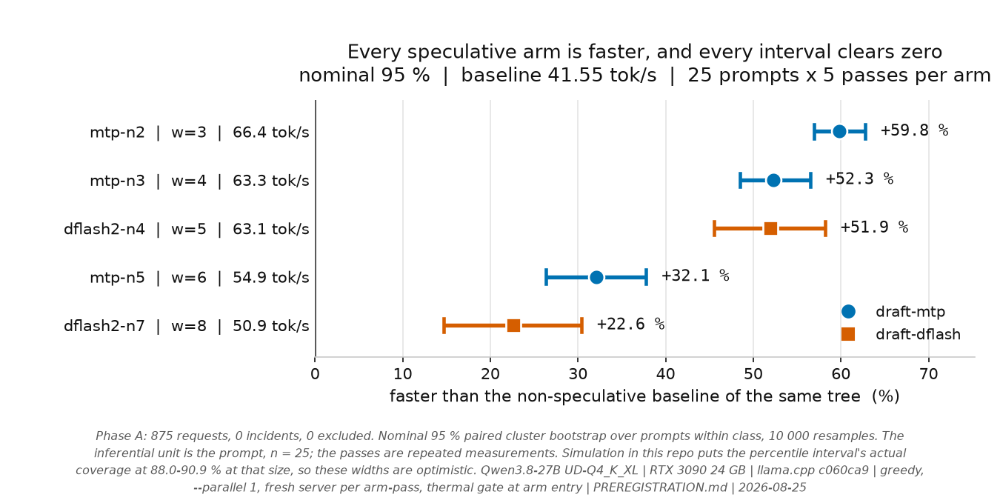
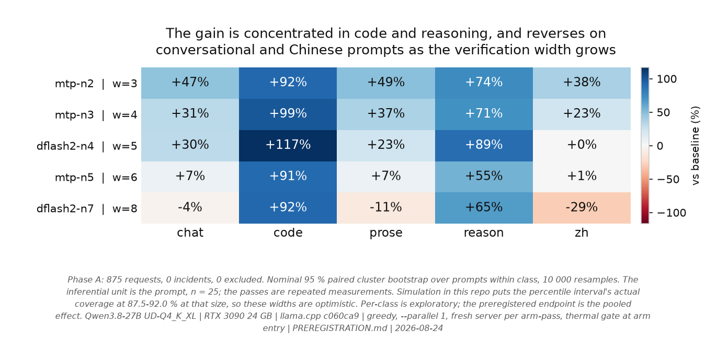

# Qwen3.8-27B speculative decoding on a single RTX 3090

A controlled study of `draft-mtp` and `draft-dflash` on llama.cpp, with the hypotheses,
the analysis plan and the prior-art sweep committed **before** any measurement in
[`PREREGISTRATION.md`](PREREGISTRATION.md), which is append-only. Two of its own hypotheses have
since been recorded as unsupported.

Successor to [`thc1006/qwen3.6-speculative-decoding-rtx3090`](https://github.com/thc1006/qwen3.6-speculative-decoding-rtx3090),
where the same question on a 3B-active MoE came out net negative on llama.cpp. That write-up
explained the loss by expert saturation: a draft of K tokens well below the ~94-token
saturation threshold forces the verify pass to load the union of K positions' expert slices. [`Qwen/Qwen3.8-27B`](https://huggingface.co/Qwen/Qwen3.8-27B)
is dense-hybrid - no experts, no routing, no union - so that mechanism cannot decide the answer
here, and the question was open again.

Phase C has since measured the predecessor's own drafting configuration on this dense target: a
0.8B draft-then-verify drafter at n-max 8 runs at **-29.8 % [-33.1, -26.4]**. The predecessor's
comparable arm, re-analysed on the class-stratified estimand this repo uses, was -21.5 %
([`docs/METHODOLOGY_AUDIT.md`](docs/METHODOLOGY_AUDIT.md)). The dense model loses **more**, with
no experts at all, so expert routing cannot be what makes that configuration lose. What separates
a win from a loss here is the drafting method, not the architecture. Phase M is being re-scoped
around that.

> **Status, 2026-08-25.** Complete: Phase A (875 request records, 0 incidents), Phase R (1125),
> Phase R2 (1575, 0 incidents), Phase KV (175), the n-max ladder (1050), Phase C (750), and the
> four-build forced-warp intervention (600) with its disassembly and kernel benchmark. The depth
> ladder has four of five rungs complete (8 K, 32 K, 64 K, 80 K) and the 96 K rung is running.
> Phase M and Phase Q are designed but have no measurements. Later
> phases are designed and not yet measured; each says so where it appears.

**For this single-stream, 8K-context, 400-token regime, it is not open any more.**

<picture>
  <source media="(prefers-color-scheme: dark)" srcset="analysis/plot_headline_dark.png">
  
</picture>

## Findings

| | |
|---|---|
| **Is it worth enabling?** | Yes. MTP at `--spec-draft-n-max 2` is **+59.8 %** [+57.0, +62.8] over no speculation. |
| **Which n-max?** | **2** for both, on the completed ladder. For `draft-mtp` it is the highest of the eight depths tested and has a slower tested point on each side. For `draft-dflash` it is the highest of the four tested, 1.7 points above `n-max=4`, but it is also the shallowest DFlash2 depth in the ladder, so it is not bracketed, and no direct paired interval between 2 and 4 has been computed. |
| **Does DFlash2 beat the built-in MTP head?** | Not on the best point estimate: **+58.8 %** for MTP `n-max=2` against **+53.7 %** for DFlash2 `n-max=2` on the same ladder. This is not a paired test between the two methods, and they run on different llama.cpp trees against their own matched baselines. At the 80 K depth rung the ordering reverses, on overlapping intervals. |
| **Energy, or just time?** | Both, in direction, and the direction is smaller than it first read. Board telemetry puts decode energy for a 400-token answer at **-37 %** (3980 -> 2503 J); correcting the two measured biases that flatter the comparison brings it nearer **-35 %**. The direction survives every audit, the exact magnitude does not: an energy-counter remeasurement is what would settle it. Details below. |
| **Bit-exact with serial greedy decoding?** | **No.** Depending on the arm, 76-80 % of requests had diverged **by output token 400**. Every request hit the token cap and none reached EOS, so the rest are right-censored: no divergence was observed inside the window, which is not identity through to the end of an answer. The divergence is deterministic and reproduces exactly across passes. |
| **Why does deeper drafting stop paying?** | Each extra verified position costs **c ~ 0.25-0.29** of a plain decode step across the whole speculative cycle, while accepted length shows diminishing increments. Over the measured clock intervals the baseline is the more memory-clock-sensitive workload and the speculative arms the more SM-clock-sensitive ones. That is a response measurement, not a roofline or a per-kernel bottleneck attribution. |
| **Does the predecessor's negative result transfer?** | Not directly. The sign differs between the two studies: a net loss on the 3B-active MoE, a large net win here. Attributing that difference to MoE routing or expert saturation needs the matched Phase M experiment, which has not run. The two studies also differ in model, target, drafter, card, power limit, llama.cpp revision and protocol. |
| **Which prompts benefit?** | Within this suite, code and reasoning most, the Chinese tasks least - and `dflash2-n7` is **+22.6 % overall while being a net loss on three of five classes**. Thinking mode is collinear with the reason class and the Chinese prompts are different tasks rather than translations, so these are differences between the selected prompts, not language or class effects. |

**Contents** - [What this is not claiming](#what-this-is-not-claiming) |
[Results](#results-phase-a) | [Cost model](#a-cost-model-not-a-table) |
[Losslessness](#losslessness) | [Resource response](#resource-response) |
[Design](#design) | [Later phases](#later-phases) | [Reproduce](#reproduce) |
[Limitations](#limitations)

## What this is not claiming

The prior-art sweep found that several things a first draft of this README would have called
"first" are already published. **The throughput table is not the contribution.** What is left,
and what this repo went after, is the protocol and the axes nobody ran: a paired interleaved
design that puts an interval on every number, a thermal gate at arm entry, per-request energy,
byte-level output divergence, and a mechanism test that separates two competing explanations for
why deeper drafting stops paying.

<details>
<summary>The five results that already exist, and whose priority is theirs</summary>

- **Single RTX 3090 + DFlash2 + a Q4 target** is already reported twice in the comment thread of
  llama.cpp PR #27342, by `treo` (`UD-Q4_K_XL`, 32K ctx) and `ouening` (`UD-Q4_K_M`, 128K ctx,
  Windows).
- **llama.cpp `draft-mtp` on a 3090** is covered in depth by
  [`sudoingX/qwen38-mtp`](https://github.com/sudoingX/qwen38-mtp), across six 3090 rows plus
  quant, KV-type, power and DSpark sweeps.
- **Drafter-quantization comparison** is partly answered in that same PR thread, on a 32 GB card.
- **vLLM on a single 3090** for this model is covered by
  [`syv-ai/qwen38-27b-rtx3090`](https://github.com/syv-ai/qwen38-27b-rtx3090).
- **Losslessness on consumer hardware** was studied in
  [arXiv 2607.17283](https://arxiv.org/html/2607.17283), though on Apple silicon, with Qwen2.5,
  and with classic two-model speculation rather than MTP or DFlash2.

</details>

## Results: Phase A

7 arms x 25 prompts x 5 passes = **875 request records, 0 incidents, 0 excluded, 0 quality-flagged.**
The inferential unit is the prompt, `n = 25`; the 5 passes are repeated measurements of the same
prompt, not independent samples, and 875 is not a sample size. Intervals are a paired cluster
bootstrap over prompts, on the class-stratified effect, and are **nominal** 95 %: this repo's own
simulation puts the percentile interval's actual coverage at 88.0-90.9 % at `n = 25`, so the
widths printed here are optimistic by roughly 15-25 %. `analyze.py` names any verdict that sits
inside that margin.

| arm | verify width | tok/s | vs own-tree baseline | tok/J | decode J per request |
|---|---:|---:|---|---:|---:|
| baseline @ master | - | 41.55 | - | 0.1005 | 3980 |
| baseline @ PR #27342 | - | **41.55** | - | 0.1005 | 3979 |
| **mtp-n2** | 3 | 66.39 | **+59.8 % [+57.0, +62.8]** | 0.1627 | **2503 (-37 %)** |
| mtp-n3 | 4 | 63.29 | +52.3 % [+48.5, +56.5] | 0.1549 | 2684 |
| dflash2-n4 | 5 | 63.13 | +51.9 % [+45.6, +58.2] | 0.1554 | 2835 |
| mtp-n5 | 6 | 54.89 | +32.1 % [+26.4, +37.8] | 0.1343 | 3228 |
| dflash2-n7 | 8 | 50.95 | +22.6 % [+14.7, +30.4] | 0.1251 | 3786 |

The two trees agree to 41.55 tok/s and produce **byte-identical output on 125/125 prompt-passes**,
so no no-speculation offset between the branches was detected here, and every DFlash2 arm is
estimated against its same-tree baseline. That controls the branch's baseline main effect. It
cannot rule out an interaction between the branch and the DFlash2 method itself, because
`draft-dflash` does not exist on the master tree and so cannot be run there. Run-to-run CV within
a prompt is <= 0.3 %.

<details>
<summary>How the energy figures are measured, and why prefill is subtracted per arm</summary>

Both energy columns are decode-only. Prefill is measured separately, in its own eight-repetition
calibration per prompt, and subtracted. Counting it, the same request goes 4050 -> 2583 J, a 36.2 %
saving. Prefill is measured per arm rather than assumed constant, and it is not: 70.9 J for the
baseline against 83.2 J for `dflash2-n7`, because a speculative arm processes the prompt through
its drafter as well. `joule`, `tok/J` and `watt` appear zero times in PR #27342's 60-comment
thread.

Both, in direction, and the direction is smaller than it first read. Board telemetry puts decode energy for a 400-token answer at **-37 %** (3980 -> 2503 J). All three limits on that figure have now been measured rather than named, and all three flatter it. `power.draw` on Ampere is a rolling average of about a second: sampled beside the instantaneous field, the two integrals agree to 0.00-0.34 % on the baselines and differ by 0.58-1.97 % on the speculative arms, always the same sign, so the averaged field understates exactly the arms being compared, worth about 1.1 points. The prefill subtraction removes a `max_tokens=1` calibration that runs on a server with the drafter already loaded, so it costs 10-17 % more energy on a speculative arm than on a baseline and takes out more than prefill: worth 0.3 to 0.8 points. The integral runs first sample to last, and the sampler's period is its nvidia-smi query plus the interval rather than the interval alone, so about 4 % of the request sits outside the window; that one moves the absolute figure rather than the ratio. Corrected for the two that bias the comparison the saving is nearer **-35 %**. `analyze.py` prints the per-arm gap and the window coverage wherever energy appears. An energy-counter remeasurement would settle the absolute magnitude. No prior-art study publishes an energy figure for this model.

</details>

### The headline number hides a sign change

<picture>
  <source media="(prefers-color-scheme: dark)" srcset="analysis/plot_per_class_dark.png">
  
</picture>

<details>
<summary>The per-class numbers</summary>

| arm | code | reason | prose | chat | zh |
|---|---:|---:|---:|---:|---:|
| mtp-n2 | +92.0 % | +73.6 % | +48.6 % | +46.9 % | +37.7 % |
| mtp-n3 | +98.9 % | +71.2 % | +37.0 % | +31.3 % | +23.2 % |
| dflash2-n4 | +116.8 % | +89.4 % | +23.0 % | +30.2 % | +0.3 % |
| mtp-n5 | +90.7 % | +54.9 % | +7.1 % | +7.1 % | +0.6 % |
| **dflash2-n7** | +91.8 % | +65.4 % | **-11.1 %** | **-4.3 %** | **-28.7 %** |

</details>

`dflash2-n7` is +22.6 % overall. It is also a net loss on three of five classes. That is the same
failure this repo documents in the predecessor's own headline, where a mixture statistic got
reported as an effect - except here it runs the other way: the average flatters an arm that is
negative on most of the classes this suite declares. It is not negative on most of any real
workload, because the five classes carry equal weight by construction and no deployment traffic
mix has been measured. Which is why the primary endpoint is class-stratified, and why a
deployment figure would have to reweight these classes by its own traffic.

### The verification-step cost model

`speedup = mean_len / k`, with `k(w) = k0 + c*(w-1)` fitted inside the MMVQ dispatch path. On the
completed ladder that is **c = 0.2904** for `draft-mtp` over widths 2-8 and **0.2481** for
`draft-dflash` over 3, 5 and 7. Paired on the 25 prompts both are fitted on, the difference is
**-0.0424 [-0.0434, -0.0413]** and clears zero, so the two methods do not share a marginal cost
and part of it moves with the drafter. Width 9 leaves the kernel and is analysed separately.

Derivation, the dispatch boundary, and what `k` does and does not identify:
[`docs/COST_MODEL.md`](docs/COST_MODEL.md).

### Greedy output divergence

Depending on the arm, **76-80 % of requests had diverged from serial greedy decoding by output
token 400**, deterministically and identically across passes. Every request hit the cap and none
reached EOS, so the rest are right-censored rather than proven identical. Arms group by
verification width rather than by drafter, but about a fifth of each group's agreement is two arms
both failing to diverge inside the window, and the four-build intervention rules out warp count as
the cause of the grouping.

The matrix, the censoring accounting and the width partition:
[`docs/GREEDY_DIVERGENCE.md`](docs/GREEDY_DIVERGENCE.md).

### Clock response

With the SM clock pinned rather than power-capped, the baseline and the speculative arms respond
to opposite clocks: memory-clock elasticity **0.79-0.81 against 0.13-0.18**, SM-clock elasticity
**0.27 against 0.76-0.81**. The ordering also changes with the interval, 1.14x apart below
1200 MHz and 2.85x above it, which is why elasticities are never pooled across that boundary.
Nothing here counts bytes moved or arithmetic issued, so it locates neither workload against a
hardware limit.

Per-interval intervals and the pinning method: [`docs/RESOURCE_RESPONSE.md`](docs/RESOURCE_RESPONSE.md).

## Design

| | |
|---|---|
| target | `unsloth/Qwen3.8-27B-GGUF`, `Qwen3.8-27B-UD-Q4_K_XL.gguf` (17.56 GB) |
| architecture | `qwen35`, 64 layers, `full_attention_interval: 4` -> **48 Gated DeltaNet + 16 full attention**, vocab 248320, native VL |
| MTP | embedded in the quant: `qwen35.nextn_predict_layers = 1`, `blk.64.nextn.*` present (verified by reading the GGUF) |
| GPU | 1 x RTX 3090 24 GB, driver 610.43.02, 420 W default, **reset to stock for the primary matrix** - the card was found overclocked and the first Phase A run was discarded ([`docs/GPU_AS_FOUND.md`](docs/GPU_AS_FOUND.md)) |
| host | Debian 13, kernel 6.12, i9-13900, 31 GB RAM |
| engine | llama.cpp from source, CUDA 13.3, `CMAKE_CUDA_ARCHITECTURES=86`, two trees with identical flags |
| trees | `master` @ `c060ca9` (build 200), **PR #27342** (DFlash2, unmerged) @ `d1a522f` |
| prompts | 25, balanced **5 per class** over code / prose / reason / chat / zh; every prompt written to exceed the 400-token cap |
| sampling | greedy, full sampler chain pinned explicitly, `cache_prompt: false`, `--parallel 1` |

<details>
<summary>The ten controls, and the specific failure each one prevents</summary>

Every one of these was added because something measurable went wrong without it.

| control | the failure it prevents |
|---|---|
| **arms interleaved within each pass, order rotated** | running arms sequentially confounds session drift with arm identity |
| **thermal gate at arm entry** | this card sits on its cap and loses **9.3 % of SM clock** (1950 -> 1769 MHz) over one pass; larger than several effects under study, and it lands inside every paired comparison |
| **dual-tree baseline** | DFlash2 needs an unmerged branch; comparing it to a master-tree baseline would conflate the method with the branch |
| **`cache_prompt: false`, verified via `t_cache_n`** | prompts share a system message within a class; prefix caching also *interacts* with speculation ([vLLM #38182](https://github.com/vllm-project/vllm/issues/38182)) - a confound of this exact shape forced a retraction in the sibling repo |
| **drafter assertion, log evidence + `t_draft_n > 0`** | the predecessor repo shipped a table row whose draft model never attached; a flag can be accepted and ignored |
| **port-ownership guard** | a killed-but-unreaped server keeps answering `/health`; a contributor to another study published three rows measured against a zombie |
| **class-stratified primary endpoint** | the effect has **opposite signs** across classes; a raw mean reports the prompt mixture as if it were a result |
| **cluster bootstrap over prompts** | passes of one prompt are repeated measures, not independent samples |
| **degeneracy screen relative to baseline** | collapsed output is fast; [vLLM #52475](https://github.com/vllm-project/vllm/issues/52475) reports MTP repetition collapse on this model family |
| **stock-clock enforcement** | this card arrived overclocked while the README said "stock"; the harness now reads the offsets and **refuses to run** unless they are zero or an overclock is declared |

A full audit of the predecessor repo's methodology is in
[`docs/METHODOLOGY_AUDIT.md`](docs/METHODOLOGY_AUDIT.md), including a re-analysis of that repo's
own committed data showing its headline effect was understated about two-fold by prompt-class
mixture.

</details>

<details>
<summary>Two things went wrong and are recorded, not smoothed over</summary>

1. **The card arrived overclocked** (memory +400 MHz, core +100 MHz, 450 W against a 420 W
   default) while this README described it as stock. The first Phase A run was **discarded**, the
   card reset, and the harness now refuses to start on a non-stock card.
   [`docs/GPU_AS_FOUND.md`](docs/GPU_AS_FOUND.md).
2. **The completed run's process crashed** with a glibc `double free or corruption` after writing
   its last record. The cause was a harness bug (`preexec_fn` alongside a sampling thread, now
   `start_new_session=True`). All 875 request records survived; the final pass's derived comparisons
   were recomputed from the recorded text. `PREREGISTRATION.md`, Correction 2.

</details>

## Later phases

Each hypothesis was written down before its data existed, in the addenda to
[`PREREGISTRATION.md`](PREREGISTRATION.md). Six of the eight below have since been measured; the
status column says which.

| phase | question | status |
|---|---|---|
| **R2** | does the compute elasticity hold with the SM clock pinned rather than power-capped? | **complete**, 1575 request records, 0 incidents |
| **KV** | does the width partition survive an f16 cache, or was it an artefact of q8_0? | complete |
| **n-max** | the full width ladder, 2 to 9, for the CUDA boundary question | **complete**, 1050 request records. Within the 400-token window, widths 2-8 produce two stable first-fork and censoring signatures, `{2,3,4}` and `{5,6,7,8}`, with 9 on its own past the MMVQ dispatch limit. The registered partition matched, but the four-build intervention then falsified warp count as its cause, so this is an observational signature and not a mechanism |
| **C** | does drafter quantization change the answer, and does the predecessor's v3.0 need an erratum? | **complete**, 750 request records, 0 incidents. It barely changes the answer and the highest precision is the slowest: q8 **+53.4 %**, q4k **+52.0 %**, bf16 **+48.5 %**, so a bf16 drafter costs about five points to run. The class effect dwarfs the quantization effect: across the three precisions code runs +111 % to +118 %, reason +86 % to +92 % and zh -2.3 % to +0.8 %, a spread of more than a hundred points between classes against five between precisions. The three n-gram methods fail three different ways, and the counters separate them: `ngram-mod` has `t_draft_n = 0` on all 75 records and output byte-identical to baseline on all 75, so its flag was accepted and did nothing; `ngram-map-k` drafts on 6 of 75; `ngram-cache` drafts 9699 tokens and accepts **none**, which is where its -8.3 % comes from |
| **L** | does the long-context decode collapse of [#27623](https://github.com/ggml-org/llama.cpp/issues/27623) reproduce on sm_86, and does speculation survive it? | **running**, four of five rungs complete: 8 K, 32 K, 64 K and 80 K, 180 records each. Through a realised 81 921 tokens there is no collapse: the baseline goes 39.7 -> 28.3 tok/s, a factor of 1.4 against the reported 25. Speculation neither amplifies nor masks the decline; retention against each method's own 8 K rung is 71.4 % for the baseline, 73.4 % for mtp-n2 and 79.8 % for dflash2-n4, and the speedups hold at +53.5 % and +61.1 % on overlapping intervals. The report's worked example is 1.4 tok/s at 91 K, which only the fifth rung reaches, so the verdict is withheld until 96 K completes |
| **M** | does `draft-mtp` at small n-max escape the penalty that a 0.8B `draft-simple` at n-max 8 suffers, and does the architecture decide it? | designed, not run. 21 arms, 1575 records, about 4.8 h. Re-anchored and re-armed after an audit: the -44.6 % it was built to reproduce belongs to the predecessor's DFlash arm, not the 0.8B one it replicates, which was -21.5 % class-stratified, so the registered gate of "worse than -25 %" would have failed a correct replication. It also had no dense arm at all - every arm ran the MoE file - so it could only compare against numbers from another day. Three dense arms now run in the same session against their own baseline, and two widths were added so the draft-then-verify path has more than one point inside MMVQ. Phase C separately measured that configuration at -29.8 % on the dense target, which is why the phase is no longer described as identifying MoE routing. Corrections 9 and 10 |
| **Q** | does the target quantization ladder move the marginal cost per verified position? | driver written, not run, and **not preregistered** until Correction 10 - unlike every other row here it had no entry in `PREREGISTRATION.md`. `cost_model.py` now puts a prompt-cluster interval on `c`, which it did not before, so a difference between rungs finally has something to be compared against. On this card only two of four rungs are reachable, about one bit of span against a 2.7 % run-to-run drift in `c`; `phase_qsmall` spans four times the range and is the better instrument here |
| **V** | does the same comparison hold on vLLM rather than llama.cpp? | designed, [`docs/PHASE_V_DESIGN.md`](docs/PHASE_V_DESIGN.md) |

## Reproduce

```bash
# toolchain (Debian 13; NVIDIA CUDA repo already configured)
sudo apt-get install -y cuda-toolkit-13-3 ninja-build ccache

# two trees, identical flags: DFlash2 is an unmerged PR, so there is no prebuilt for it, and
# mixing a prebuilt master with a self-built PR binary would reintroduce a build confound
# The two trees these results were measured on. Both branches have moved since, so the
# commits are pinned and verified: without this you build something else and get something else.
LLAMA_MASTER_COMMIT=c060ca9
DFLASH2_COMMIT=d1a522f

git clone https://github.com/ggml-org/llama.cpp llamacpp-master
git -C llamacpp-master checkout --detach $LLAMA_MASTER_COMMIT
cp -r llamacpp-master llamacpp-dflash2
git -C llamacpp-dflash2 fetch origin pull/27342/head
git -C llamacpp-dflash2 checkout --detach $DFLASH2_COMMIT
test "$(git -C llamacpp-master   rev-parse --short HEAD)" = "$LLAMA_MASTER_COMMIT" || exit 1
test "$(git -C llamacpp-dflash2  rev-parse --short HEAD)" = "$DFLASH2_COMMIT"      || exit 1

for t in llamacpp-master llamacpp-dflash2; do
  CUDACXX=/usr/local/cuda-13.3/bin/nvcc cmake -B $t/build -S $t -GNinja \
    -DGGML_CUDA=ON -DCMAKE_CUDA_ARCHITECTURES=86 -DGGML_CCACHE=ON -DCMAKE_BUILD_TYPE=Release
  cmake --build $t/build -j --target llama-server
done

# models, then check them against the hashes these runs loaded
hf download unsloth/Qwen3.8-27B-GGUF Qwen3.8-27B-UD-Q4_K_XL.gguf --local-dir models/target
hf download z-lab/Qwen3.8-27B-DFlash2-GGUF --local-dir models/dflash2
sha256sum -c models/SHA256SUMS

# the harness's own tests: one case per defect this study shipped and later found
python3 harness/test_harness.py

# run + analyse (standard library only)
python3 harness/bench.py --matrix phase_a --passes 5 --out results/phase_a.json
python3 harness/analyze.py results/phase_a.json

# figures (the only step that needs a third-party package). Use the venv's interpreter:
# the harness itself runs on the system python, matplotlib is installed only here, and
# analysis/plot.py imports it at module level.
.venv/bin/pip install matplotlib && .venv/bin/python analysis/plot.py
```

`harness/bench.py --prompts-per-class 1` runs a reduced dry run; reduced runs label themselves in
the output file so they can never be mistaken for a full result.

## Limitations

- **Single card, single host.** Absolute tok/s are **not** comparable to the predecessor repo's
  numbers: that work used two other physical 3090s with 350 W caps.
- **`-c 8192` for the primary matrix.** Long-context behaviour - including whether speculation
  survives the ~25x decode collapse past ~80 K reported in
  [llama.cpp #27623](https://github.com/ggml-org/llama.cpp/issues/27623) - is a separate phase.
- **No EAGLE3.** The build supports `draft-eagle3` but no EAGLE3 drafter has been published for
  Qwen3.8-27B, so the method cannot be evaluated.
- **No multimodal input** in the primary matrix; llama.cpp has historically refused speculation
  together with `--mmproj` ([#19712](https://github.com/ggml-org/llama.cpp/issues/19712)).
- **Single-stream only** in Phase A. Speculative decoding is a single-stream optimisation and its
  advantage is reported by others to vanish by `--parallel 4`; measuring that is a later phase.
- **Long-output workload.** Every primary prompt was written to reach the 400-token cap. Short
  answers and natural EOS termination are not represented, so this does not transfer to ordinary
  short chat traffic.
- **Curated prompts, not traffic.** The five classes carry equal weight by design. A deployment
  figure would have to reweight them by its own traffic mix, which has not been measured.
- **Statistical scope.** The inferential unit is 25 prompts, not 875 records. The percentile
  cluster bootstrap undercovers at that size (88.0-90.9 % against a nominal 95 %), so the printed
  intervals are too narrow, and none of them carry uncertainty from changing host, card, build,
  model or prompt population.
- **Output agreement is right-censored.** Every primary request hit the token cap and none reached
  EOS. A record counted as identical means no divergence was observed within 400 tokens; it is not
  a statement about the whole answer.
- **No semantic-quality benchmark.** The harness measures byte-level divergence and obvious
  degeneration. Whether a diverged answer is better, worse or equivalent is not tested.
- **Dual-tree interaction.** Same-tree baselines control the branch's no-speculation main effect.
  They cannot identify a branch-by-DFlash2 interaction, because `draft-dflash` cannot be run on
  the master tree at all.
- **Energy magnitude is provisional.** Energy comes from sampled board-power telemetry and a
  separately measured prefill calibration. The audits support the direction; the exact percentage
  needs a hardware energy counter.
- **Residual order effects.** Phase A rotates arm order, but 5 passes do not close a 7-arm
  rotation, so each arm visits 5 of 7 positions, and prompt order is fixed in class blocks. The
  harness has `--latin-arms` and `--shuffle-prompts` (`bench.py:217`), but the committed primary
  matrix predates them and changing the design mid-study would have been worse.

## License

MIT for code. Results (JSON / CSV) under CC-0.

## Author

Hsiu-Chi Tsai | GitHub [`thc1006`](https://github.com/thc1006)
