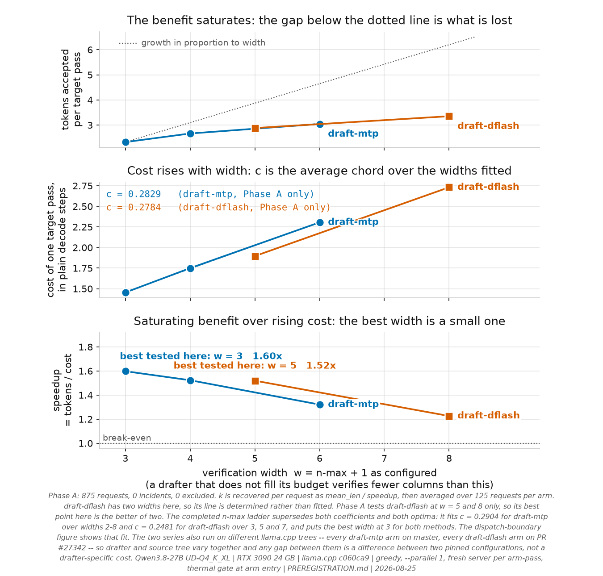
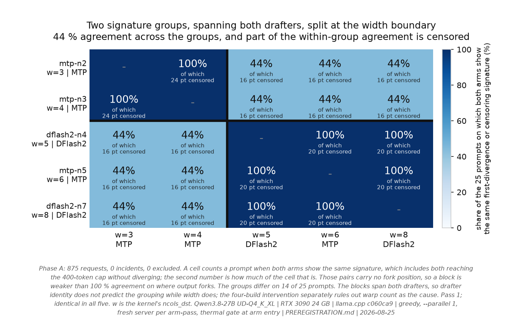
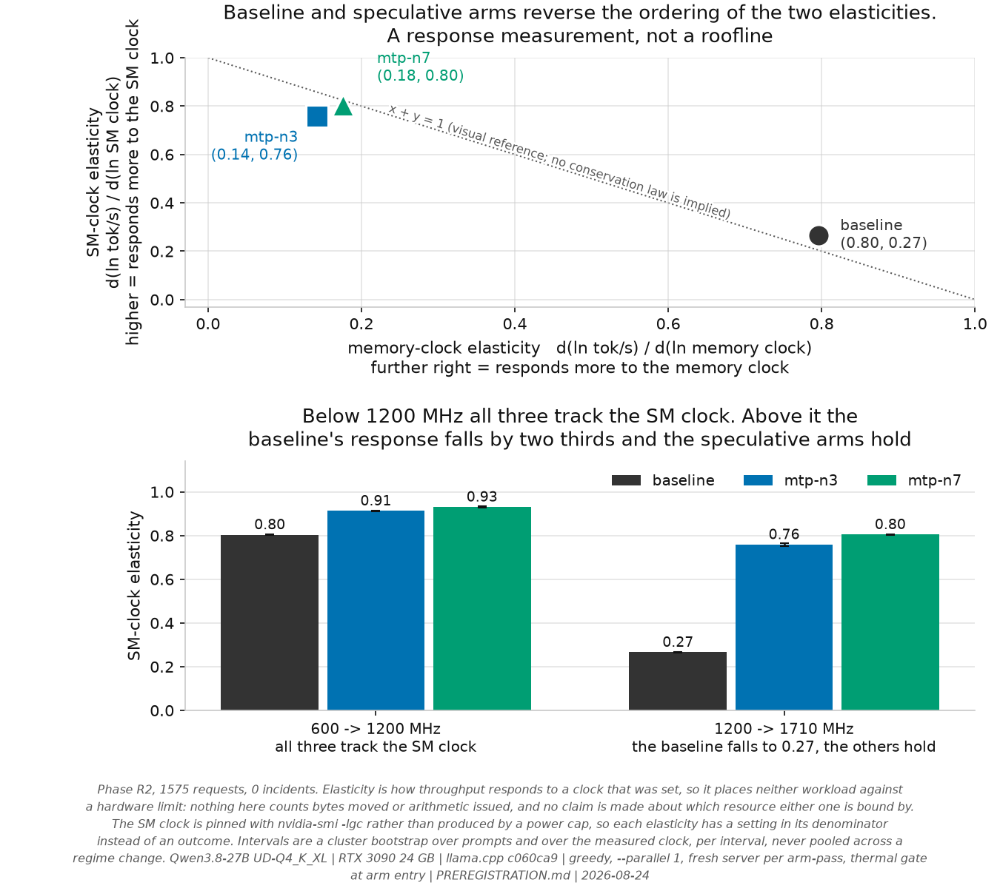

# Qwen3.8-27B speculative decoding on a single RTX 3090

A controlled study of `draft-mtp` and `draft-dflash` on llama.cpp, with the hypotheses,
the analysis plan and the prior-art sweep committed **before** any measurement in
[`PREREGISTRATION.md`](PREREGISTRATION.md), which is append-only. Two of its own hypotheses have
since been recorded as unsupported.

Successor to [`thc1006/qwen3.6-speculative-decoding-rtx3090`](https://github.com/thc1006/qwen3.6-speculative-decoding-rtx3090),
where the same question on a 3B-active MoE came out net negative on llama.cpp. That write-up
explained the loss by expert saturation: a draft of K tokens well below the ~94-token
saturation threshold forces the verify pass to load the union of K positions' expert slices. [`Qwen/Qwen3.8-27B`](https://huggingface.co/Qwen/Qwen3.8-27B)
is dense-hybrid — no experts, no routing, no union — so that mechanism cannot decide the answer
here, and the question was open again.

> **Status, 2026-08-25.** Phase A complete (875 measurements, 0 incidents), Phase R complete
> (1125), **Phase R2 complete (1575, 0 incidents)**. Phase KV and the n-max ladder are running.
> Later phases are designed and not yet measured; each says so where it appears.

**It is not open any more.**

<picture>
  <source media="(prefers-color-scheme: dark)" srcset="analysis/plot_headline_dark.png">
  
</picture>

## Findings

| | |
|---|---|
| **Is it worth enabling?** | Yes. MTP at `--spec-draft-n-max 2` is **+59.8 %** [+57.0, +62.8] over no speculation. |
| **Which n-max?** | **2** for `draft-mtp`, **4** for `draft-dflash` — the best of those measured, and derived from a cost model rather than picked from a table. |
| **Does DFlash2 beat the built-in MTP head?** | No. **+51.9 %** at its own best depth. It drafts longer blocks and its fixed cost is lower, but acceptance falls faster with depth. |
| **Energy, or just time?** | Both. **−37 %** decode energy for a 400-token answer (3980 → 2503 J). No prior-art study publishes an energy figure for this model. |
| **Lossless at temperature 0?** | **No.** 76–80 % of greedy requests diverge from the non-speculative baseline. Deterministic, and it reproduces exactly across passes. |
| **Why does deeper drafting stop paying?** | Each extra verified position costs **c ≈ 0.28** of a plain decode step. With both clocks pinned, the baseline and the speculative arms sit in opposite corners: bandwidth elasticity **0.80 against 0.14**, compute elasticity **0.27 against 0.76**. |
| **Does the MoE result carry over?** | No. The sign flips: net loss there, large net win here. |
| **Which prompts benefit?** | Code and reasoning most, Chinese least — and `dflash2-n7` is **+22.6 % overall while being a net loss on three of five classes**. |

**Contents** — [What this is not claiming](#what-this-is-not-claiming) ·
[Results](#results-phase-a) · [Cost model](#a-cost-model-not-a-table) ·
[Losslessness](#losslessness) · [Resource response](#resource-response) ·
[Design](#design) · [Later phases](#later-phases) · [Reproduce](#reproduce) ·
[Limitations](#limitations)

## What this is not claiming

The prior-art sweep found that several things a first draft of this README would have called
"first" are already published. **The throughput table is not the contribution.** What is left,
and what this repo went after, is the protocol and the axes nobody ran: a paired interleaved
design that puts an interval on every number, a thermal gate at arm entry, per-request energy,
byte-level output divergence, and a mechanism test that separates two competing explanations for
why deeper drafting stops paying.

<details>
<summary>The five results that already exist, and whose priority is theirs</summary>

- **Single RTX 3090 + DFlash2 + a Q4 target** is already reported twice in the comment thread of
  llama.cpp PR #27342, by `treo` (`UD-Q4_K_XL`, 32K ctx) and `ouening` (`UD-Q4_K_M`, 128K ctx,
  Windows).
- **llama.cpp `draft-mtp` on a 3090** is covered in depth by
  [`sudoingX/qwen38-mtp`](https://github.com/sudoingX/qwen38-mtp), across six 3090 rows plus
  quant, KV-type, power and DSpark sweeps.
- **Drafter-quantization comparison** is partly answered in that same PR thread, on a 32 GB card.
- **vLLM on a single 3090** for this model is covered by
  [`syv-ai/qwen38-27b-rtx3090`](https://github.com/syv-ai/qwen38-27b-rtx3090).
- **Losslessness on consumer hardware** was studied in
  [arXiv 2607.17283](https://arxiv.org/html/2607.17283), though on Apple silicon, with Qwen2.5,
  and with classic two-model speculation rather than MTP or DFlash2.

</details>

## Results: Phase A

7 arms × 25 prompts × 5 passes = **875 measurements, 0 incidents, 0 excluded, 0 quality-flagged.**
Intervals are a paired cluster bootstrap over prompts, on the class-stratified effect.

| arm | verify width | tok/s | vs own-tree baseline | tok/J | decode J per request |
|---|---:|---:|---|---:|---:|
| baseline @ master | — | 41.55 | — | 0.1005 | 3980 |
| baseline @ PR #27342 | — | **41.55** | — | 0.1005 | 3979 |
| **mtp-n2** | 3 | 66.39 | **+59.8 % [+57.0, +62.8]** | 0.1627 | **2503 (−37 %)** |
| mtp-n3 | 4 | 63.29 | +52.3 % [+48.5, +56.5] | 0.1549 | 2684 |
| dflash2-n4 | 5 | 63.13 | +51.9 % [+45.6, +58.2] | 0.1554 | 2835 |
| mtp-n5 | 6 | 54.89 | +32.1 % [+26.4, +37.8] | 0.1343 | 3228 |
| dflash2-n7 | 8 | 50.95 | +22.6 % [+14.7, +30.4] | 0.1251 | 3786 |

The two trees agree to 41.55 tok/s and produce **byte-identical output on 125/125 prompt-passes**,
so nothing in the DFlash2 numbers is attributable to the unmerged branch. Run-to-run CV within a
prompt is ≤ 0.3 %.

<details>
<summary>How the energy figures are measured, and why prefill is subtracted per arm</summary>

Both energy columns are decode-only. Prefill is measured separately, in its own eight-repetition
calibration per prompt, and subtracted. Counting it, the same request goes 4050 → 2583 J, a 36.2 %
saving. Prefill is measured per arm rather than assumed constant, and it is not: 70.9 J for the
baseline against 83.2 J for `dflash2-n7`, because a speculative arm processes the prompt through
its drafter as well. `joule`, `tok/J` and `watt` appear zero times in PR #27342's 60-comment
thread.

</details>

### The headline number hides a sign change

<picture>
  <source media="(prefers-color-scheme: dark)" srcset="analysis/plot_per_class_dark.png">
  
</picture>

<details>
<summary>The per-class numbers</summary>

| arm | code | reason | prose | chat | zh |
|---|---:|---:|---:|---:|---:|
| mtp-n2 | +92.0 % | +73.6 % | +48.6 % | +46.9 % | +37.7 % |
| mtp-n3 | +98.9 % | +71.2 % | +37.0 % | +31.3 % | +23.2 % |
| dflash2-n4 | +116.8 % | +89.4 % | +23.0 % | +30.2 % | +0.3 % |
| mtp-n5 | +90.7 % | +54.9 % | +7.1 % | +7.1 % | +0.6 % |
| **dflash2-n7** | +91.8 % | +65.4 % | **−11.1 %** | **−4.3 %** | **−28.7 %** |

</details>

`dflash2-n7` is +22.6 % overall. It is also a net loss on three of five classes. That is the same
failure this repo documents in the predecessor's own headline, where a mixture statistic got
reported as an effect — except here it runs the other way: the average flatters an arm that hurts
most of the workload. Which is why the primary endpoint is class-stratified.

### A cost model, not a table

llama.cpp reports enough per request to recover the cost of one speculative verification step in
units of a plain decode step, as `speedup = mean_len / k` with `k(w) = k0 + c·(w − 1)` and
`w = n_max + 1`.

<picture>
  <source media="(prefers-color-scheme: dark)" srcset="analysis/plot_cost_model_dark.png">
  
</picture>

| method | widths | k0 | **c** | r² |
|---|---|---:|---:|---:|
| `draft-mtp` | 3, 4, 6 | 0.8937 | **0.2829** | 0.9998 |
| `draft-dflash` | 5, 8 | 0.7825 | **0.2784** | (2 points, so r² is arithmetic) |

**`c` agrees to 1.6 %** between the target's own built-in nextn head and a structurally unrelated
1.1 GB block-diffusion drafter, while `k0` differs by 14 %. The marginal cost of verifying one
more position belongs to the verification path; the fixed cost belongs to the drafter, and
DFlash2's fixed cost is the *lower* of the two.

`mean_len` saturates with depth while `k` grows linearly, so the ratio has an interior maximum in
principle. **Over the widths measured here it falls monotonically, so the best setting is simply
the smallest one tested** — 2 for MTP, 4 for DFlash2, on this card at this target quantisation.
Establishing that the true optimum is interior needs n-max 1, which `phase_nmax` adds.

<details>
<summary>Why an RTX 5090 report recommends the opposite setting, and what would have to differ</summary>

The PR thread disagrees. `lance0` reports on an RTX 5090 with a `UD-Q6_K_XL` target that n-max 7
is right for DFlash2, since the drafter's `block_size` is 8 and lower values discard tokens the
block already paid for. Here n-max 4 beats n-max 7 by a wide margin, 1.520× against 1.228×.

The model says both can be true, and says what would have to differ. For width 8 to beat width 5
on this measured acceptance curve, `c` would have to be below **0.0543**; it is 0.2784 here, 5.1
times too large. Phase R2 shows what moves `c`: with the SM clock pinned, the baseline responds to
core clock with an elasticity of 0.27 while the speculative arms sit at 0.76-0.81, so `c` is a
compute cost and falls as compute rises relative to memory bandwidth — exactly the axis separating
a 5090 from a 3090. The prediction is that a card with `c` under 0.0543 prefers
the deeper setting with the same drafter and the same acceptance, and measuring `c` needs one
baseline and three widths.

One assumption is doing work there and is not verified: the calculation uses this card's
`mean_len` curve, taken at `UD-Q4_K_XL`. A higher-precision target may accept more, which would
raise `mean_len` at depth and make the required `c` less extreme. Phase Q walks the target
quantisation ladder to separate the two.

</details>

<details>
<summary>A missing "− 1" that produced plausible wrong numbers, and what it changed</summary>

`mean_len = (predicted_n − 1) / (predicted_n − accepted − 1)`. The `− 1` was missing at first and
the numbers it produced looked fine. The first generated token comes out of the prompt-processing
pass, not out of a decode forward, and leaving it in the count inflated the forward count by one.
Checking the derivation against the server's own `mean len` log line on all 625 speculative
requests is what found it.

The correction moves `c` by 0.8 % and changes nothing claimed here, but it is why
[`upstream/`](upstream/) carries a one-line patch to expose the verification-step count the
server already holds: a derivation that reproduces plausible numbers and is quietly wrong by a
percent is exactly what an exposed counter prevents. Around 30 % of requests need one further
step removed, which is what truncation at the token cap looks like, and the API cannot say which,
so the figures above are low by under 1 % and are reported as such.

Across five prompt classes whose acceptance rates differ by nearly tenfold, the class means of
`k` span **0.26 % to 0.94 %** of their own mean, depending on the arm. An earlier version of this
section quoted 0.35–0.54 %, which was the dispersion of `k` over individual requests rather than
over class means. The record-level figure is the smaller and better-looking of the two, and it is
not the one this claim is about.

</details>

<details>
<summary>What the cost model rules out: the overhead is not paid on rejection</summary>

A state-rollback account charges the overhead to *rejection*: 48 of this model's 64 layers are
Gated DeltaNet and cannot roll back by truncating a KV suffix. Writing that as
`k = k_verify + r·n_max·(1 − acceptance)` makes `r` estimable from the slope of `k` against
acceptance. Across an acceptance range of **0.096–0.918**, every arm returns **|r| ≤ 0.0028**
decode-steps per rejected token, r² between 0.001 and 0.060.

The overhead is paid per position **verified**, not per draft **rejected**. That does not make
rollback free; it bounds how much of the measured cost rollback can account for, and the bound is
approximately none. The hypothesis was this repo's own, pre-registered, and is reported as
unsupported.

</details>

### Losslessness

Speculative arms are byte-identical to their baseline on only 25–30 of 125 prompt-passes:
**76–80 % of requests diverge**, forking at a median 23 % into the text. Every arm is nonetheless
**100/100 reproducible across passes**, so the divergence is deterministic rather than noise.

<picture>
  <source media="(prefers-color-scheme: dark)" srcset="analysis/plot_width_partition_dark.png">
  
</picture>

Fork positions partition the arms into exactly two groups by verification width, `{3,4}` against
`{5,6,8}`, identically in all five passes. **The grouping crosses drafters**: width 5 and width 8
are DFlash2 while width 6 is the built-in MTP head, and all three agree with each other on every
prompt. So drafter identity does not predict the grouping and verification width does. That
boundary is where the CUDA `calc_nwarps` table switches `ncols_dst` from four warps to two.

This corroborates [llama.cpp #25618](https://github.com/ggml-org/llama.cpp/issues/25618) rather
than discovering anything: that thread already establishes the phenomenon, its
quantization-dependence, its drafter-independence, and a root cause on the Vulkan side. What is
still open is the **CUDA** boundary, and a width-localised boundary is what this repo can add.
[llama.cpp #26750](https://github.com/ggml-org/llama.cpp/issues/26750) asks the same question on
Blackwell; this card is sm_86 and cannot answer it. See
[`docs/UPSTREAM_CONTRIBUTIONS.md`](docs/UPSTREAM_CONTRIBUTIONS.md).

### Resource response

<picture>
  <source media="(prefers-color-scheme: dark)" srcset="analysis/plot_bound_by_dark.png">
  
</picture>

Phase R varied memory bandwidth and power budget independently, 1125 measurements, and confirmed
the assumption the design rests on: lowering the power limit to 250 W and 175 W leaves the memory
clock at 9501 MHz unchanged, so the two levers are separable on this card. Its own review then
found that a power cap is a poor compute lever, because the clock it produces is an outcome rather
than a setting. **Phase R2** re-ran the compute axis with the SM clock pinned at 600, 1200 and
1710 MHz, 1575 measurements, 0 incidents, and it is the one quoted here.

At the top of the clock range the two workloads sit in opposite corners:

| | bandwidth elasticity | compute elasticity | bound by |
|---|---:|---:|---|
| baseline | **0.79-0.81** | **0.27** | memory bandwidth |
| mtp-n3 | 0.13-0.15 | 0.76 | compute |
| mtp-n7 | 0.17-0.18 | 0.81 | compute |

The two elasticities very nearly swap. That is what speculation does to the workload: one target
pass scores several positions at once, so the decode stops waiting on memory and starts waiting on
arithmetic.

The regime matters and the intervals show where it changes. From 600 to 1200 MHz everything is
compute-starved and everything scales with clock: baseline 0.804, mtp-n3 0.913, mtp-n7 0.931.
From 1200 to 1710 MHz the baseline hits its bandwidth ceiling and stops responding, 0.266, while
the speculative arms keep scaling at 0.759 and 0.805. The ratio between them therefore is not one
number: it is 1.14x in the low regime and 2.85x in the high one, which is why this repo reports
elasticities per interval and never pools them across a regime change.

Pinning also tightened the intervals to the third decimal, because the denominator is now a
setting rather than something the card negotiates with its power cap.

## Design

| | |
|---|---|
| target | `unsloth/Qwen3.8-27B-GGUF` · `Qwen3.8-27B-UD-Q4_K_XL.gguf` (17.56 GB) |
| architecture | `qwen35`, 64 layers, `full_attention_interval: 4` → **48 Gated DeltaNet + 16 full attention**, vocab 248320, native VL |
| MTP | embedded in the quant: `qwen35.nextn_predict_layers = 1`, `blk.64.nextn.*` present (verified by reading the GGUF) |
| GPU | 1 × RTX 3090 24 GB, driver 610.43.02, 420 W default, **reset to stock for the primary matrix** — the card was found overclocked and the first Phase A run was discarded ([`docs/GPU_AS_FOUND.md`](docs/GPU_AS_FOUND.md)) |
| host | Debian 13, kernel 6.12, i9-13900, 31 GB RAM |
| engine | llama.cpp from source, CUDA 13.3, `CMAKE_CUDA_ARCHITECTURES=86`, two trees with identical flags |
| trees | `master` @ `c060ca9` (build 200) · **PR #27342** (DFlash2, unmerged) @ `d1a522f` |
| prompts | 25, balanced **5 per class** over code / prose / reason / chat / zh; every prompt written to exceed the 400-token cap |
| sampling | greedy, full sampler chain pinned explicitly, `cache_prompt: false`, `--parallel 1` |

<details>
<summary>The ten controls, and the specific failure each one prevents</summary>

Every one of these was added because something measurable went wrong without it.

| control | the failure it prevents |
|---|---|
| **arms interleaved within each pass, order rotated** | running arms sequentially confounds session drift with arm identity |
| **thermal gate at arm entry** | this card sits on its cap and loses **9.3 % of SM clock** (1950 → 1769 MHz) over one pass; larger than several effects under study, and it lands inside every paired comparison |
| **dual-tree baseline** | DFlash2 needs an unmerged branch; comparing it to a master-tree baseline would conflate the method with the branch |
| **`cache_prompt: false`, verified via `t_cache_n`** | prompts share a system message within a class; prefix caching also *interacts* with speculation ([vLLM #38182](https://github.com/vllm-project/vllm/issues/38182)) — a confound of this exact shape forced a retraction in the sibling repo |
| **drafter assertion, log evidence + `t_draft_n > 0`** | the predecessor repo shipped a table row whose draft model never attached; a flag can be accepted and ignored |
| **port-ownership guard** | a killed-but-unreaped server keeps answering `/health`; a contributor to another study published three rows measured against a zombie |
| **class-stratified primary endpoint** | the effect has **opposite signs** across classes; a raw mean reports the prompt mixture as if it were a result |
| **cluster bootstrap over prompts** | passes of one prompt are repeated measures, not independent samples |
| **degeneracy screen relative to baseline** | collapsed output is fast; [vLLM #52475](https://github.com/vllm-project/vllm/issues/52475) reports MTP repetition collapse on this model family |
| **stock-clock enforcement** | this card arrived overclocked while the README said "stock"; the harness now reads the offsets and **refuses to run** unless they are zero or an overclock is declared |

A full audit of the predecessor repo's methodology is in
[`docs/METHODOLOGY_AUDIT.md`](docs/METHODOLOGY_AUDIT.md), including a re-analysis of that repo's
own committed data showing its headline effect was understated about two-fold by prompt-class
mixture.

</details>

<details>
<summary>Two things went wrong and are recorded, not smoothed over</summary>

1. **The card arrived overclocked** (memory +400 MHz, core +100 MHz, 450 W against a 420 W
   default) while this README described it as stock. The first Phase A run was **discarded**, the
   card reset, and the harness now refuses to start on a non-stock card.
   [`docs/GPU_AS_FOUND.md`](docs/GPU_AS_FOUND.md).
2. **The completed run's process crashed** with a glibc `double free or corruption` after writing
   its last record. The cause was a harness bug (`preexec_fn` alongside a sampling thread, now
   `start_new_session=True`). All 875 measurements survived; the final pass's derived comparisons
   were recomputed from the recorded text. `PREREGISTRATION.md`, Correction 2.

</details>

## Later phases

Designed, pre-registered and not yet measured. Each hypothesis was written down before its data
existed, in the addenda to [`PREREGISTRATION.md`](PREREGISTRATION.md).

| phase | question | status |
|---|---|---|
| **R2** | does the compute elasticity hold with the SM clock pinned rather than power-capped? | **complete**, 1575 measurements, 0 incidents |
| **KV** | does the width partition survive an f16 cache, or was it an artefact of q8_0? | complete |
| **n-max** | the full width ladder, 2 to 9, for the CUDA boundary question | running |
| **C** | does drafter quantization change the answer, and does the predecessor's v3.0 need an erratum? | queued |
| **L** | does the long-context decode collapse of [#27623](https://github.com/ggml-org/llama.cpp/issues/27623) reproduce on sm_86, and does speculation survive it? | designed, ladder to 96K |
| **M** | does `draft-mtp` at small n-max escape the MoE penalty that `draft-simple` at n-max 8 suffers? | designed, anchored on reproducing the predecessor's −44.6 % |
| **Q** | does the target quantization ladder move the marginal cost per verified position? | driver written, needs a 48 GB card above `UD-Q5_K_XL` |
| **V** | does the same comparison hold on vLLM rather than llama.cpp? | designed, [`docs/PHASE_V_DESIGN.md`](docs/PHASE_V_DESIGN.md) |

## Reproduce

```bash
# toolchain (Debian 13; NVIDIA CUDA repo already configured)
sudo apt-get install -y cuda-toolkit-13-3 ninja-build ccache

# two trees, identical flags: DFlash2 is an unmerged PR, so there is no prebuilt for it, and
# mixing a prebuilt master with a self-built PR binary would reintroduce a build confound
git clone https://github.com/ggml-org/llama.cpp llamacpp-master
cp -r llamacpp-master llamacpp-dflash2
cd llamacpp-dflash2 && git fetch origin pull/27342/head:pr-27342 && git checkout pr-27342 && cd ..
for t in llamacpp-master llamacpp-dflash2; do
  CUDACXX=/usr/local/cuda-13.3/bin/nvcc cmake -B $t/build -S $t -GNinja \
    -DGGML_CUDA=ON -DCMAKE_CUDA_ARCHITECTURES=86 -DGGML_CCACHE=ON -DCMAKE_BUILD_TYPE=Release
  cmake --build $t/build -j --target llama-server
done

# models
hf download unsloth/Qwen3.8-27B-GGUF Qwen3.8-27B-UD-Q4_K_XL.gguf --local-dir models/target
hf download z-lab/Qwen3.8-27B-DFlash2-GGUF --local-dir models/dflash2

# run + analyse (standard library only)
python3 harness/bench.py --matrix phase_a --passes 5 --out results/phase_a.json
python3 harness/analyze.py results/phase_a.json

# figures (the only step that needs a third-party package)
pip install matplotlib && python3 analysis/plot.py
```

`harness/bench.py --prompts-per-class 1` runs a reduced dry run; reduced runs label themselves in
the output file so they can never be mistaken for a full result.

## Limitations

- **Single card, single host.** Absolute tok/s are **not** comparable to the predecessor repo's
  numbers: that work used two other physical 3090s with 350 W caps.
- **`-c 8192` for the primary matrix.** Long-context behaviour — including whether speculation
  survives the ~25× decode collapse past ~80 K reported in
  [llama.cpp #27623](https://github.com/ggml-org/llama.cpp/issues/27623) — is a separate phase.
- **No EAGLE3.** The build supports `draft-eagle3` but no EAGLE3 drafter has been published for
  Qwen3.8-27B, so the method cannot be evaluated.
- **No multimodal input** in the primary matrix; llama.cpp has historically refused speculation
  together with `--mmproj` ([#19712](https://github.com/ggml-org/llama.cpp/issues/19712)).
- **Single-stream only** in Phase A. Speculative decoding is a single-stream optimisation and its
  advantage is reported by others to vanish by `--parallel 4`; measuring that is a later phase.

## License

MIT for code. Results (JSON / CSV) under CC-0.

## Author

Hsiu-Chi Tsai · GitHub [`thc1006`](https://github.com/thc1006)
