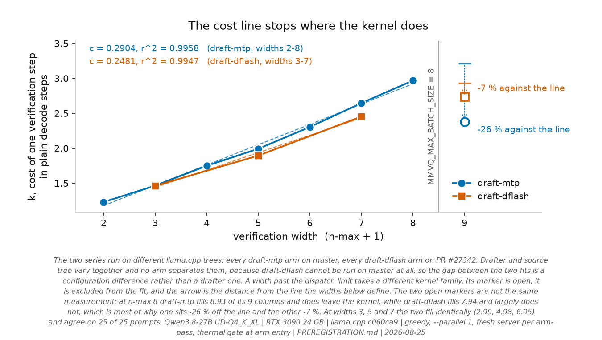

# Qwen3.8-27B speculative decoding on a single RTX 3090

[](https://doi.org/10.5281/zenodo.22149941)

A controlled study of `draft-mtp` and `draft-dflash` on llama.cpp. **Phase A is the primary
single-RTX-3090 result**; the follow-up phases use a second 3090, an RTX A6000, a Qwen3.6 MoE
target, a Qwen3.5-9B ladder and vLLM, and their absolute throughput figures are not pooled with it.

Phase A's hypotheses and analysis plan were committed **before** Phase A data collection, in
[`PREREGISTRATION.md`](PREREGISTRATION.md), which is append-only **by project policy** -- `master`
carries no branch protection and the commits are unsigned, so what makes a published state
independently checkable is the signed tags and the archived deposit, not the promise; later-phase
hypotheses were
appended before their own runs. An analysis whose scoring implementation was written after its
data is labelled exploratory where that applies. Registered hypotheses have since been recorded as
unsupported, falsified, withdrawn, reopened and unresolved; the dated disposition of each is in
that file.

Successor to [`thc1006/qwen3.6-speculative-decoding-rtx3090`](https://github.com/thc1006/qwen3.6-speculative-decoding-rtx3090),
where the same question on a 3B-active MoE came out net negative on llama.cpp. That write-up
attributed the loss to expert saturation: a draft of K tokens well below the ~94-token
saturation threshold forces the verify pass to load the union of K positions' expert slices. [`Qwen/Qwen3.8-27B`](https://huggingface.co/Qwen/Qwen3.8-27B)
is dense-hybrid - no experts, no routing, no union - so that mechanism cannot decide the answer
here, and the question was open again.

Phase C has since measured the predecessor's own drafting configuration on this dense target: a
0.8B draft-then-verify drafter at n-max 8 runs at **-29.8 % [-33.1, -26.4]**. The predecessor's
comparable arm, re-analysed on the class-stratified estimand this repo uses, was -21.5 %
([`docs/METHODOLOGY_AUDIT.md`](docs/METHODOLOGY_AUDIT.md)). The dense model also loses, and by a larger
point estimate, with no experts at all, so **expert routing is not necessary for that configuration
to lose.** The two figures come from different benchmarks and the comparison of their magnitudes is
not controlled: only the sign is being carried across.

That is a narrower statement than it may look, and it is deliberately the only one made here.
"Not necessary" is not "not a cause" and not "does not affect the size of the loss". Attributing
the cross-study difference to drafting method rather than architecture would take Phase M, and
Phase M's preregistered replication anchor failed
([`analysis/phase_m_anchor.txt`](analysis/phase_m_anchor.txt): *"nothing else in Phase M should be
read as a statement about the predecessor until this is understood"*). This README therefore
draws no architecture conclusion.

### Evidence status

Every count below is computed from the result files by
[`harness/render_evidence.py`](harness/render_evidence.py) each time it runs; only the question,
the strength of the reading and the claims a phase must not be used for are maintained by hand, in
[`evidence/registry.json`](evidence/registry.json). This block used to be a hand-written paragraph
with a date on it, and the date did not help: it said Phase B was running while 525 committed
records sat in `results/phase_b.json`, and it never mentioned Phase R, which has 1125.
`scripts/verify_everything.sh` section 7 regenerates this and fails if it has moved.

<!-- BEGIN GENERATED: EVIDENCE_STATUS -->
| phase | data, computed from the files | inference |
|---|---|---|
| A | 875 records, complete, 0 incidents | primary result |
| A-1600 | 525 records, complete, 0 incidents | within-run contrasts reported -- re-measured 2026-08-28. The first extended-cap run took two host_contended incidents from another session's data-perturbation suite; the replacement carries none, and the arm-by-arm comparison that justified retiring the older file is in analysis/rerun_agreement.txt |
| A-hostB | 175 records, complete, 0 incidents | association, not a controlled contrast |
| B | 525 records, complete, 0 incidents | exploratory -- H2 and H2' and the arm design were in the initial commit; the model comparison was committed before the run finished; the forward-count robustness sweep was added after the data; re-measured 2026-08-28 after the first run took two host_contended incidents from this session's own nvidia-smi and git, with the comparison in analysis/rerun_agreement.txt |
| C | 750 records, complete, 0 incidents | within-run contrasts reported |
| KV | 175 records, complete, 0 incidents | control |
| L | 900 records over 5 files, complete, 0 incidents | within-run contrasts reported |
| M | 1575 records, complete, 0 incidents | within-run contrasts reported -- the preregistered replication anchor does not hold, and the phase's own gate then forbids reading it as a statement about the predecessor |
| n-max | 1050 records, complete, 0 incidents | within-run contrasts reported |
| Q | 600 records over 2 files, complete, 0 incidents | association, not a controlled contrast |
| Qs | 1500 records over 4 files, complete, 0 incidents | association, not a controlled contrast |
| R | 1125 records, complete, 0 incidents | within-run contrasts reported |
| R2 | 1575 records, complete, 0 incidents | within-run contrasts reported |
| V | 75 records, complete, 6 incidents | **not evaluable** -- both MTP arms fail during server start on 24 GiB; the baseline served |
| warp | 1950 records over 13 files, complete, 0 incidents | control -- four builds of one revision differing only in the GENERIC warp table, plus an A6000 replication |
| E | 450 records, complete, 0 incidents | control -- power limit is the load lever -- 420, 250 and 150 W -- because at stock every arm sits between 409.8 and 415.7 W, 97.6 to 99.0 % of the cap, and a load-dependent instrument error cannot be separated from a constant one when the load never changes |
| E2 | 450 records, complete, 0 incidents | control -- Phase E re-run with the spread of the power trace recorded. The three earlier candidates were each tested against a proxy because the record carried no spread; `power_max_w - power_mean_w` is `cap - mean` while the card sits at its limit, and understated the true spread by a factor of two |
| E3 | 450 records over 9 files, complete, 0 incidents | control -- Phase E's two 420 W arms re-run at three sampler periods over three rounds with the order rotated. `power.draw` is a one-second rolling average whatever rate it is queried at and `power.draw.instant` is not, so refining the grid separates a real energy difference from what trapezoidal integration does to two signals with different frequency content |
| E4 | 450 records over 9 files, complete, 0 incidents | control -- Phase E3's two 420 W arms re-run with idle held around the sampling window, so both of its ends sit in the same steady state. Committed data already said the offset is per-window rather than per-second -- across 35 file-arm cells the longest third of each has a 1.81x window and a 1.01x offset -- but window length varies inside a cell because prompts generate at different speeds, which is a correlation with the window and not a manipulation of it. This manipulates it. The power traces are recorded, so `power.draw` can be deconvolved against `power.draw.instant` and the averaging width read off directly rather than quoted |
| E5 | 225 records, complete, 0 incidents | control -- one baseline arm at three power caps, with Phase E4's 4 s roll and traces. The cap sets how far the card climbs above its idle-with-model draw of about 128 W, so it sets the step: about 284 W at 420, 121 at 250, 22 at 150, a range of 13x against the 1.4x the committed records happen to span on their own. Three passes over three arms so the rotation closes and each cap visits each order position exactly once -- E3 and E4 could leave arm order fixed because their estimand was within-arm, and this one is between arms |
| E6 | 225 records over 9 files, complete, 0 incidents | control -- one arm at the stock 420 W cap so the step is held, with the generation length moved instead -- 200, 400 and 800 tokens, giving windows of about 9.0, 13.9 and 23.2 s at a step that varies 2.5 %. Phase E5's only lever was the power cap, which sets the step and the generation rate together at a Spearman of -0.917, so its split into a step-scaled part and a fixed part is a property of the model chosen (Correction 50). The 400-token cell reproduces E5's top cap -- span 13.88 against 13.91, step 286.5 against 287.4 -- so the two phases measure the same object and the models it cannot separate coincide there and diverge either side of it |
<!-- END GENERATED: EVIDENCE_STATUS -->

### What each phase may not be used to claim

Declared per phase in [`evidence/registry.json`](evidence/registry.json) and rendered here by the
same script that writes the table above. Twenty-seven of these exist as a note in a JSON file that
nothing read: a limit only the author can see is a limit only the author is bound by. They are
**not** mechanically enforced -- they are sentences about what an argument may not do, not strings
a scanner can match. `scripts/verify_everything.sh` section 5 catches specific withdrawn wordings;
these are the wider constraints those wordings came from.

<!-- BEGIN GENERATED: FORBIDDEN_CLAIMS -->
| phase | must not be used to claim |
|---|---|
| A | representative deployment traffic: the 25 prompts were purposively constructed<br>semantic equivalence: only byte-level divergence is measured |
| A-1600 | identity: a run that matched inside the 1600-token cap is right-censored, not byte-identical<br>representative deployment traffic: the 25 prompts were purposively constructed |
| A-hostB | absolute tok/s pooled with Phase A: different host |
| B | quantization or arithmetic intensity as the cause: no intervention on either<br>the joint drafted/rejected coefficients: the regressors correlate at +0.9963<br>absolute ms/step and ms/token: they wait on an exact verification-step count |
| C | a demonstrated separation between two drafter precisions: no paired interval was computed<br>n-gram efficacy from an arm that never activated |
| L | a refutation of #27623: that report is a different architecture, quantization and software stack<br>throttling excluded: only SM-clock drift is ruled out as the explanation<br>a method separation at depth: the deepest rungs' intervals overlap |
| M | anything about the predecessor: the anchor failed<br>an architecture effect: same gate<br>k, c, k0, the marginal-cost equality and the fixed-cost ratio: mean_len fails its integrity check here |
| Q | a causal reading: the two rungs ran in different sessions<br>the rungs a 24 GB card cannot hold: two of four are blocked on VRAM |
| Qs | agreement or disagreement with #26750: the estimator and prompt population are not known to match<br>bf16 parity: 36 of 75 bf16 requests still diverge<br>the drafter's compute being unchanged: the MTP head is inside the quantized target |
| R | a roofline or per-kernel bottleneck attribution: these are response measurements<br>independent clock effects: this phase moves them through a power cap |
| R2 | a roofline or per-kernel bottleneck attribution |
| V | an engine-isolated comparison: engine, quantization and checkpoint format differ together<br>a depth-specific engine limitation from the k=2 failure: it is the same allocation failing |
| warp | generalisation past the tested table, devices, quantized kernels and prompts |
| E | a speedup or efficiency figure: the 250 W and 150 W arms exist to put the instruments under three loads, not because anyone would run the card there<br>an absolute energy calibration: two instruments agreeing bounds their mutual consistency, not their accuracy against an external meter<br>a generalisation of the counter's agreement past this card, this driver and windows read exactly twice |
| E2 | a speedup or efficiency figure: the arms exist to put the instruments under three loads<br>a mechanism for the offset: this phase refuted a fourth candidate and identified none<br>reading the pooled correlations as within-arm ones; the two disagree, and for mean power they disagree in sign |
| E3 | a speedup or efficiency figure: the arms exist to vary the sampler, and under --passes 1 the arm order does not rotate, so arm and position within an invocation are collinear<br>a difference in thermal behaviour between the two arms, for the same reason<br>a mechanism for the offset: this phase settles which reading is wrong, not why the averaging loses what it loses<br>generalising the counter's agreement past this card, this driver and windows read exactly twice |
| E4 | any energy, efficiency or tok/J figure: a rolled window's `energy_j`, `decode_energy_j` and `sample_span_s` all include the roll, so they describe an object no other phase measured. `energy_instruments.py` refuses to sweep a file that declares one<br>a speedup figure, and any difference between the two arms: under --passes 1 the arm order does not rotate, so arm and position within an invocation are collinear<br>a mechanism for whatever offset survives the roll: this phase measures that residual and does not explain it<br>generalising the measured averaging width past this card and this driver version; it is a property of one firmware, read through one nvidia-smi |
| E5 | any energy, efficiency or tok/J figure: a rolled window's `energy_j`, `decode_energy_j` and `sample_span_s` all include the roll, so they describe an object no other phase measured, and `energy_instruments.py` refuses to sweep a file that declares one<br>a speedup figure or any statement about speculative decoding: every arm is the baseline and they differ only in the power cap<br>a re-test of Phase E4's closed form on an unrolled window: every arm here carries the 4 s roll, so this phase measures what survives one and not what the model accounts for<br>reading the 250 W and 150 W caps as configurations anyone would run; they are here to move the step |
| E6 | any throughput, energy or efficiency figure: the generation length is 200 and 800 tokens as well as this study's standard 400, so nothing here is comparable with another phase, and a rolled window's energy includes the roll<br>a speedup figure or any statement about speculative decoding: there is one arm and no contrast<br>reading the between-length change as a span effect without section 3b: a longer generation is a hotter card, so temperature moves with the manipulation, and within a cell temperature and position in the pass are very nearly the same variable<br>a re-test of Phase E4's closed form on an unrolled window: every window here carries the 4 s roll |
<!-- END GENERATED: FORBIDDEN_CLAIMS -->

Two things the table cannot carry. Phase V's arms did not merely underperform: `baseline-vllm`
serves and gives a vLLM baseline datapoint for the compressed-tensors checkpoint used in Phase V -- not a cross-engine anchor, because engine, checkpoint format, quantization and runtime all change together and no arm separates them -- and both MTP arms fail to load on this card
because the MTP module allocates its own bf16 `embed_tokens` and `lm_head`, 2.37 GiB each, on top
of a 17.33 GiB target, filed as
[vllm#53887](https://github.com/vllm-project/vllm/issues/53887). And Phase Q sits at two rungs of
four because two rungs need 27.5 and 31.3 GB of VRAM, which is a limit of the card and not of the
design.

**On the measured prompt suite and the exact Phase A system, MTP is a clear
server-reported decode-throughput win.** The 25 prompts were purposively constructed rather than
sampled from deployment traffic, so this is not a claim about representative traffic. Semantic
quality, mechanism, multi-user serving, generalisation across GPUs and the exact energy magnitude
are all open.

<picture>
  <source media="(prefers-color-scheme: dark)" srcset="analysis/plot_headline_dark.png">
  
</picture>

## Findings

| | |
|---|---|
| **Is it worth enabling?** | For this benchmark, **yes if byte-exact serial-greedy parity is not required.** MTP `n-max 2` is **+59.8 % [+57.0, +62.8]** on server-reported decode. |
| **Which n-max?** | **2**, for both methods. Chosen and evaluated on the same ladder, so that is a selection-on-the-data figure. |
| **Does DFlash2 beat the built-in MTP head?** | **Not established.** Best tested point estimates favour MTP (+59.8 % against +51.9 %), the arms run on different llama.cpp trees, and no paired interval separates the methods. |
| **Energy?** | **-37.1 %** decode energy by board telemetry, nearer **-35 %** after two measured sensitivity adjustments and **-36.3 %** on a matched re-reading with a second instrument that separately replicates the headline to 0.03 points. Uncalibrated against an external meter, and not an identical-answer comparison. [`docs/ENERGY.md`](docs/ENERGY.md) |
| **Bit-exact with serial greedy decoding?** | **No.** At a 1600-token cap, **23 to 25 of 25 prompts diverged** for each arm, deterministically. No record that reached EOS matched its baseline. [`docs/GREEDY_DIVERGENCE.md`](docs/GREEDY_DIVERGENCE.md) |
| **Why does deeper drafting stop paying?** | Accepted length shows diminishing increments while each extra verified position costs **c ~ 0.25-0.29** of a plain decode step. Arc-average chords over a curved `k(w)`, not constant marginal kernel costs. [`docs/COST_MODEL.md`](docs/COST_MODEL.md) |
| **Does the predecessor's negative result transfer?** | **Data complete, causal and cost interpretation withheld.** Phase M's preregistered replication anchor does not hold, and the phase's own gate then forbids reading anything in it as a statement about the predecessor or about architecture. [`docs/PHASES.md`](docs/PHASES.md) |
| **Which prompts benefit?** | Code and reasoning most, Chinese least. `dflash2-n7` is **+22.6 % overall while negative on three of the five declared classes** -- heterogeneity, not an invalid aggregate. The classes carry equal weight by construction; a deployment figure must reweight them. |

**Contents** - [What this is not claiming](#what-this-is-not-claiming) |
[Results](#results-phase-a) | [Cost model](#the-verification-step-cost-model) |
[Greedy divergence](#greedy-output-divergence) | [Clock response](#clock-response) |
[Design](#design) | [Later phases](#later-phases) | [Reproduce](#reproduce) |
[Limitations](#limitations)

## What this is not claiming

The prior-art sweep found that several things a first draft of this README would have called
"first" are already published. **The throughput table is not the contribution.** What is left,
and what this repo went after, is the protocol and the axes not found in the dated sources
reviewed: a paired interleaved design that puts an interval on the primary throughput contrasts, a
thermal gate at arm entry, per-request telemetry-derived energy estimates, byte-level output
divergence, and a gating experiment built to compare two competing accounts of
why deeper drafting stops paying.

<details>
<summary>The five results that already exist, and whose priority is theirs</summary>

- **Single RTX 3090 + DFlash2 + a Q4 target** is already reported twice in the comment thread of
  llama.cpp PR #27342, by `treo` (`UD-Q4_K_XL`, 32K ctx) and `ouening` (`UD-Q4_K_M`, 128K ctx,
  Windows).
- **llama.cpp `draft-mtp` on a 3090** is covered in depth by
  [`sudoingX/qwen38-mtp`](https://github.com/sudoingX/qwen38-mtp), across six 3090 rows plus
  quant, KV-type, power and DSpark sweeps.
- **Drafter-quantization comparison** is partly answered in that same PR thread, on a 32 GB card.
- **vLLM on a single 3090** for this model is covered by
  [`syv-ai/qwen38-27b-rtx3090`](https://github.com/syv-ai/qwen38-27b-rtx3090).
- **Losslessness on consumer hardware** was studied in
  [arXiv 2607.17283](https://arxiv.org/html/2607.17283), though on Apple silicon, with Qwen2.5,
  and with classic two-model speculation rather than MTP or DFlash2.

</details>

## Results: Phase A

7 arms x 25 prompts x 5 passes = **875 request records, 0 incidents, 0 excluded, 0 quality-flagged.**
The inferential unit is the prompt, `n = 25`; the 5 passes are repeated measurements of the same
prompt, not independent samples, and 875 is not a sample size. Intervals are a paired cluster
bootstrap over prompts, on the class-stratified effect, and are **nominal** 95 %. They under-cover:
four synthetic absolute-difference processes come back at 87.5 to 92.0 %, and the relative-ratio
estimand this headline actually uses -- calibrated separately, on a process fitted to this data's
own shape -- covers at **90.2 % +- 0.7**. Read the widths as optimistic. `analyze.py` names any
verdict that sits inside the 1.3 half-width margin.

What the intervals are and are not, where those figures come from, and what none of them carry:
[`docs/STATISTICAL_SCOPE.md`](docs/STATISTICAL_SCOPE.md).

| arm | verify width | tok/s | vs own-tree baseline | tok/J | decode J per request |
|---|---:|---:|---|---:|---:|
| baseline @ master | - | 41.55 | - | 0.1005 | 3980 |
| baseline @ PR #27342 | - | **41.55** | - | 0.1005 | 3979 |
| **mtp-n2** | 3 | 66.39 | **+59.8 % [+57.0, +62.8]** | 0.1627 | **2503 (-37 %)** |
| mtp-n3 | 4 | 63.29 | +52.3 % [+48.5, +56.5] | 0.1549 | 2684 |
| dflash2-n4 | 5 | 63.13 | +51.9 % [+45.6, +58.2] | 0.1554 | 2835 |
| mtp-n5 | 6 | 54.89 | +32.1 % [+26.4, +37.8] | 0.1343 | 3228 |
| dflash2-n7 | 8 | 50.95 | +22.6 % [+14.7, +30.4] | 0.1251 | 3786 |

The two trees agree to 41.55 tok/s and **show no divergence from each other on 125/125 prompt-passes**, all of which stopped on the 400-token cap, so that is agreement through the measured window rather than through a whole answer,
so no no-speculation offset between the branches was detected here, and every DFlash2 arm is
estimated against its same-tree baseline. That controls the branch's baseline main effect. It
cannot rule out an interaction between the branch and the DFlash2 method itself, because
`draft-dflash` does not exist on the master tree and so cannot be run there. Run-to-run CV within
a prompt is <= 0.3 %.

<details>
<summary>How the energy figures are measured, and why prefill is subtracted per arm</summary>

Both energy columns are decode-only. Prefill is measured separately, in its own eight-repetition
calibration per prompt, and subtracted. Counting it, the same request goes 4050 -> 2583 J, a 36.2 %
saving. Prefill is measured per arm rather than assumed constant, and it is not: 70.9 J for the
baseline against 83.2 J for `dflash2-n7`, because a speculative arm processes the prompt through
its drafter as well.

The instrument, what bounds it, and why the magnitude stays provisional: [`docs/ENERGY.md`](docs/ENERGY.md).

</details>

### The headline number hides a sign change

<picture>
  <source media="(prefers-color-scheme: dark)" srcset="analysis/plot_per_class_dark.png">
  
</picture>

<details>
<summary>The per-class numbers</summary>

| arm | code | reason | prose | chat | zh |
|---|---:|---:|---:|---:|---:|
| mtp-n2 | +92.0 % | +73.6 % | +48.6 % | +46.9 % | +37.7 % |
| mtp-n3 | +98.9 % | +71.2 % | +37.0 % | +31.3 % | +23.2 % |
| dflash2-n4 | +116.8 % | +89.4 % | +23.0 % | +30.2 % | +0.3 % |
| mtp-n5 | +90.7 % | +54.9 % | +7.1 % | +7.1 % | +0.6 % |
| **dflash2-n7** | +91.8 % | +65.4 % | **-11.1 %** | **-4.3 %** | **-28.7 %** |

</details>

`dflash2-n7` is +22.6 % overall. It is also a net loss on three of five classes. That is the same
failure this repo documents in the predecessor's own headline, where a mixture statistic got
reported as an effect - except here it runs the other way: the average flatters an arm that is
negative on most of the classes this suite declares. It is not negative on most of any real
workload, because the five classes carry equal weight by construction and no deployment traffic
mix has been measured. Which is why the primary endpoint is class-stratified, and why a
deployment figure would have to reweight these classes by its own traffic.

### The verification-step cost model

`speedup = mean_len / k`, with `k(w) = k0 + c*(w-1)` fitted inside the MMVQ dispatch path. On the
completed ladder that is **c = 0.2904** for `draft-mtp` over widths 2-8 and **0.2481** for
`draft-dflash` over 3, 5 and 7. `k(w)` is curved, so a slope is a chord and two chords over
different width ranges are not the same quantity; compared on the widths both cover, 3, 5 and 7,
the difference is **-0.0473 [-0.0489, -0.0456]**. That difference is between two **configurations**,
not between two drafters: every `mtp-*` arm runs the master tree and every `dflash2-*` arm runs the
PR #27342 tree, so drafter and source tree move together. Same-tree baselines remove the branch's
no-speculation main effect and cannot remove a branch-by-speculation-by-width interaction, because
`draft-dflash` does not exist on master to be run there. The two curves differ by a straight line to
within 2.4e-4, so the curvature they share cancels and the difference survives it. The chords are
not shared between the two methods over the widths both cover. A configured n-max of 8 puts the
requested width at 9, past `MMVQ_MAX_BATCH_SIZE`; what each method actually fills there differs
(draft-mtp 8.93 columns of 9, draft-dflash 7.94), so that point is analysed separately per method
rather than labelled as one boundary crossing.

Phase M fitted the same method on a 35B-A3B MoE and a 27B dense target in one session and is
**excluded from this section**: its `mean_len` derivation fails `cost_model.py`'s own integrity
check on that phase, and every quantity here is a function of `mean_len`. The dense n-max ladder
above stands on its own check. What the exclusion costs is the cross-architecture comparison of
`c`; nothing in this repository currently bounds a difference in marginal cost between the two
targets.

<picture>
  <source media="(prefers-color-scheme: dark)" srcset="analysis/plot_dispatch_boundary_dark.png">
  
</picture>

This is the completed ladder. `plot_cost_model.png`
([light](analysis/plot_cost_model.png), [dark](analysis/plot_cost_model_dark.png) -- a plain link
cannot switch on the reader's theme the way the figures above do) fits the same model to Phase A alone, which reaches `c = 0.2829` and `0.2784` and puts DFlash2's best width at
5; the ladder above supersedes both coefficients and both optima, and that figure is kept because the
Phase A subset is what the earlier write-ups quoted.

Derivation, the dispatch boundary, and what `k` does and does not identify:
[`docs/COST_MODEL.md`](docs/COST_MODEL.md).

### Greedy output divergence

At a 400-token cap **19 to 20 of the 25 prompts had diverged** from serial greedy decoding for each
arm, and every request hit that cap without reaching EOS, so the rest were right-censored rather than identical.
Re-running the same prompts and arms at **1600 tokens** resolves most of that: divergence reaches
**100 % for dflash2-n4, dflash2-n7 and mtp-n5**, 96 % for mtp-n2 and 92 % for mtp-n3; 267 of 525
records now stop at EOS; and censoring falls to **9 of 375 records on 2 of 25 prompts**. It is
deterministic and identical across passes at both caps, 150 of 150 and 125 of 125 repeated cells.

The first-divergence signatures form stable groups by effective verification width rather than by
drafter, **{3,4} and {5,6,8} at both caps**. Widths are grouped only on prompts where both actually
diverged: at 400 that was 19-20 of 25 prompts per pair, at 1600 it is 23 of 25 for widths 3 and 4
and all 25 for the rest, so the larger budget leaves the same partition resting on more evidence.
The four-build intervention still falsifies the tested `calc_nwarps` change as the cause of the
grouping.

<picture>
  <source media="(prefers-color-scheme: dark)" srcset="analysis/plot_width_partition_dark.png">
  
</picture>

Fork positions are exact: `harness/exact_forks.py` tokenizes the two stored outputs and takes the
first index at which they differ, which is well defined because they share a byte-identical
prefix. Forks land between **token 6 and token 359** at the 400-token cap and as late as **token
1406** at 1600. The character-per-token estimate this used to report is off by more than five
tokens on about half the records.

The matrix, the censoring accounting and the width partition:
[`docs/GREEDY_DIVERGENCE.md`](docs/GREEDY_DIVERGENCE.md).

### Clock response

With the SM clock pinned rather than power-capped, the ORDERING of the two elasticities reverses
between the baseline and the speculative arms. Both workloads respond to both clocks; what changes
is which one they respond to more: memory-clock elasticity **0.79-0.81 against 0.13-0.18**, SM-clock elasticity
**0.27 against 0.76-0.81**. The ordering also changes with the interval, 1.14x apart below
1200 MHz and 2.85x above it, which is why elasticities are never pooled across that boundary.
Nothing here counts bytes moved or arithmetic issued, so it locates neither workload against a
hardware limit.

<picture>
  <source media="(prefers-color-scheme: dark)" srcset="analysis/plot_bound_by_dark.png">
  
</picture>

Per-interval intervals and the pinning method: [`docs/RESOURCE_RESPONSE.md`](docs/RESOURCE_RESPONSE.md).

## Design

| | |
|---|---|
| target weights | `unsloth/Qwen3.8-27B-GGUF`, `Qwen3.8-27B-UD-Q4_K_XL.gguf`, 17.56 GB / 16.35 GiB |
| architecture | `qwen35`, 64 layers, `full_attention_interval: 4` -> **48 Gated DeltaNet + 16 full attention**, vocab 248320 |
| MTP | embedded in the quant: `qwen35.nextn_predict_layers = 1`, `blk.64.nextn.*` present (verified by reading the GGUF) |
| GPU | 1 x RTX 3090 24 GB, driver 610.43.02, 420 W default, **reset to stock for the primary matrix** - the card was found overclocked and the first Phase A run was discarded ([`docs/GPU_AS_FOUND.md`](docs/GPU_AS_FOUND.md)) |
| host | Debian 13, kernel 6.12, i9-13900, 31 GB RAM |
| engine | llama.cpp from source, CUDA 13.3, `CMAKE_CUDA_ARCHITECTURES=86`, two trees with identical flags |
| engine revisions | `master` @ `c060ca974c773c7c3d17fd1b66dc9d312bc292c0` (build 200); **PR #27342** (DFlash2, unmerged) at the historical commit `d1a522fc89c96d1a3057e35681f0c4859810623c`. Full forty characters, because an abbreviated hash can resolve to a different object as a repository grows, which is the one thing pinning exists to prevent. That PR's head has since moved past this commit, so nothing here covers later revisions of it |
| prompts | 25, balanced **5 per class** over code / prose / reason / chat / zh; every prompt written to exceed the 400-token cap |
| sampling | greedy, full sampler chain pinned explicitly, `cache_prompt: false`, `--parallel 1` |

<details>
<summary>The ten controls, and the specific failure each one prevents</summary>

Every one of these was added because something measurable went wrong without it.

| control | the failure it prevents |
|---|---|
| **arms interleaved within each pass, order rotated** | running arms sequentially confounds session drift with arm identity |
| **thermal gate at arm entry** | this card sits on its cap and loses **9.3 % of SM clock** (1950 -> 1769 MHz) over one pass; larger than several effects under study, and it lands inside every paired comparison |
| **dual-tree baseline** | DFlash2 needs an unmerged branch; comparing it to a master-tree baseline would conflate the method with the branch |
| **`cache_prompt: false`, verified via `t_cache_n`** | prompts share a system message within a class; prefix caching also *interacts* with speculation ([vLLM #38182](https://github.com/vllm-project/vllm/issues/38182)) - a confound of this exact shape forced a retraction in the sibling repo |
| **drafter activation evidence** | a model-based drafter must show positive draft counters in the server log; a thresholded n-gram method instead reports its activation rate against its configured threshold, because zero activation can be the method working as designed. The predecessor repo shipped a table row whose draft model never attached, and a flag can be accepted and ignored |
| **port-ownership guard** | a killed-but-unreaped server keeps answering `/health`, so a benchmark can measure a process that is no longer the one it started |
| **class-stratified primary endpoint** | the effect has **opposite signs** across classes; a raw mean reports the prompt mixture as if it were a result |
| **cluster bootstrap over prompts** | passes of one prompt are repeated measures, not independent samples |
| **degeneracy screen relative to baseline** | collapsed output is fast; [vLLM #52475](https://github.com/vllm-project/vllm/issues/52475) reports MTP repetition collapse on this model family |
| **stock-clock enforcement** | this card arrived overclocked while the README said "stock"; the harness now reads the offsets and **refuses to run** unless they are zero or an overclock is declared |

A full audit of the predecessor repo's methodology is in
[`docs/METHODOLOGY_AUDIT.md`](docs/METHODOLOGY_AUDIT.md), including a re-analysis of that repo's
own committed data showing its headline effect was understated about two-fold by prompt-class
mixture.

</details>

<details>
<summary>Two Phase A execution incidents, recorded rather than smoothed over</summary>

1. **The card arrived overclocked** (memory +400 MHz, core +100 MHz, 450 W against a 420 W
   default) while this README described it as stock. The first Phase A run was **discarded**, the
   card reset, and the harness now refuses to start on a non-stock card.
   [`docs/GPU_AS_FOUND.md`](docs/GPU_AS_FOUND.md).
2. **The completed run's process crashed** with a glibc `double free or corruption` after writing
   its last record. The cause was a harness bug (`preexec_fn` alongside a sampling thread, now
   `start_new_session=True`). All 875 request records survived; the final pass's derived comparisons
   were recomputed from the recorded text. `PREREGISTRATION.md`, Correction 2.

</details>

## Later phases

Ten follow-up phases -- B, C, KV, L, M, n-max, Q, Q-small, R, R2 and V -- with their questions,
status and what each may not be used to claim, are in [`docs/PHASES.md`](docs/PHASES.md). Their
record counts and incident counts appear in the generated status block above, computed from the
result files rather than maintained by hand.

Their absolute throughput is never pooled with Phase A's: they use other hosts, GPUs, models,
engines and sessions, and only within-host contrasts are compared.

## Reproduce

```bash
git fetch --tags && git switch --detach phase-a-v1
./scripts/reproduce_phase_a.sh
```

`phase-a-v1` is the harness Phase A was measured on, and the checkout is part of the procedure:
pinning llama.cpp, CUDA, the models and the card while leaving the harness free to be any later
version of itself is a different experiment. The script compares commits and stops if they differ;
`ALLOW_HARNESS_DRIFT=1` runs an independent replication instead, which is a weaker claim.

Every version-specific value comes from [`repro/phase_a.lock.json`](repro/phase_a.lock.json) rather
than a copy inside the script, so a rerun and the record of what was measured cannot drift apart.

The two modes, what the script refuses to do, and why overlapping intervals are not agreement:
[`docs/REPRODUCIBILITY.md`](docs/REPRODUCIBILITY.md).

## Limitations

The ones that bound what the headline means. Three longer ones moved out with the sections that
explain them: the statistical scope to [`docs/STATISTICAL_SCOPE.md`](docs/STATISTICAL_SCOPE.md),
and Phase M's cost exclusions and the cross-session quantization ladders to
[`docs/PHASES.md`](docs/PHASES.md).


- **Single card, single host.** Absolute tok/s are **not** comparable to the predecessor repo's
  numbers: that work used two other physical 3090s with 350 W caps.
- **`-c 8192` for the primary matrix.** Long-context behaviour - including whether speculation
  survives the ~25x decode collapse past ~80 K reported in
  [llama.cpp #27623](https://github.com/ggml-org/llama.cpp/issues/27623) - is a separate phase.
- **No EAGLE3.** The build supports `draft-eagle3` but no EAGLE3 drafter has been published for
  Qwen3.8-27B, so the method cannot be evaluated.
- **No multimodal input** in the primary matrix; llama.cpp has historically refused speculation
  together with `--mmproj` ([#19712](https://github.com/ggml-org/llama.cpp/issues/19712)).
- **Single-stream only** in Phase A. Speculative decoding is a single-stream optimisation and its
  advantage is reported by others to vanish by `--parallel 4`; measuring that is a later phase.
- **Long-output workload.** Every primary prompt was written to reach the 400-token cap. Short
  answers and natural EOS termination are not represented, so this does not transfer to ordinary
  short chat traffic.
- **Curated prompts, not traffic.** The five classes carry equal weight by design. A deployment
  figure would have to reweight them by its own traffic mix, which has not been measured.
- **Output agreement is right-censored, much less so since the cap was raised.** At a 400-token cap
  every primary request hit the cap and none reached EOS. The 1600-token re-run leaves 9 of 375
  records censored and 267 of 525 reaching EOS. Those 9 still mean no divergence was observed
  within 1600 tokens; they are not a statement about the whole answer. The re-run does carry the
  cross-tree control: `baseline@pr27342` against `baseline@master` on 75 records, identical on all
  75, of which 36 had both sides reach EOS and 39 are themselves right-censored.
- **No semantic-quality benchmark.** The harness measures byte-level divergence and obvious
  degeneration. Whether a diverged answer is better, worse or equivalent is not tested.
- **Dual-tree interaction.** Same-tree baselines control the branch's no-speculation main effect.
  They cannot identify a branch-by-DFlash2 interaction, because `draft-dflash` cannot be run on
  the master tree at all.
- **Energy magnitude is provisional, and it is not an identical-answer comparison.** Energy comes
  from sampled board-power telemetry and a separately measured prefill calibration. The audits
  support the direction. The magnitude is not calibrated: an external power meter is the reference
  that would settle it. The driver's cumulative-energy counter has now been read alongside, on 450
  records across a 2.75x power range, and it agrees with the instantaneous power sensor to within
  0.15 % on every arm while both depart from `power.draw` -- the averaged field every published
  figure here integrates -- by up to 1.9 %. That gap is not a proportional error and so does not
  cancel between two arms; on a matched pair at the same cap it moves the headline to -36.3 %.
  It is not an integration artefact either: Phase E3 varied nothing but the sampler's period
  over a 3x range of achieved rates and the instantaneous integral did not move, staying within
  0.23 % of the driver's cumulative counter -- read exactly twice per window and so unable to
  move with the rate -- while the averaged field sat 0.31 to 1.86 % below that counter and drifted
  further from it as the grid refined. So the offset is a real energy difference and `power.draw`
  is the reading that loses it. **Phase E4 then measured what it loses it to.** `power.draw` is a
  boxcar average of `power.draw.instant`, and deconvolving one against the other puts its median
  width at **1.00 to 1.10 s** on both arms -- measured on this card and this driver, where the
  figure had only ever been quoted as "about a second". Thirteen of the 75 unrolled baseline
  records fit at the search grid's ceiling instead, which is what a flat trace does to a
  deconvolution rather than evidence of a wider filter; every window with a roll in it is 0 of 75. Averaging over a width T is linear and preserves
  the integral under it, but integrating the RESULT across a window loses `(T/2)` times the
  difference between the window's two ends, whatever the trace does in between. With T measured
  there is no free parameter left, and the closed form accounts for the whole unrolled offset:
  predicted against observed is **1.06** on the baseline and **1.08** on the speculative arm, with
  98 % and 93 % of it accruing inside the first T seconds. Holding idle around the window so both
  ends sit in one state collapses it, **24.11 to 6.43 J and 46.03 to 6.35 J**, while the window
  itself gets LONGER -- which refuses a per-second loss and a loss unchanged by flat idle in the
  same measurement. The arm-dependence needs no separate explanation: T is one number, and the
  speculative arm's window ends differ by more. What is left unexplained at the longest roll is **5.7 J on
  both arms**, and it is not a per-second loss: the steady-power plateau carries under a joule
  of it whether that plateau runs 7.7 s or 4.1 s, so it sits at the edges, where the boxcar
  model already is. That both arms carry the same amount distinguishes nothing -- at this roll
  both windows hold the same idle-to-cap excursion, so anything sized by it is predicted to be
  equal. **Phase E5 varied that excursion on purpose**, moving the step 10.8x with the power
  cap. The fit gives a step-scaled part at **+19.7 ms** and a fixed part of **+3.56 J**. Phase E5
  could not choose between that and a 1/span reading, because its cap moved both at once. Phase
  E6 held the cap and moved the generation length instead, and the 1/span reading required the
  residual to fall where it rose -- but only by **2.5 standard errors on two degrees of
  freedom**, which is a lean and not a refusal. **The split remains model-dependent**, and
  settling it would take about ten rounds against the three E6 ran. Windows holding no load transition at all put the two fields **0.499 W** apart at the
  idle floor with the joules scaling with the window, which no linear filter can produce --
  though it belongs to the lowest clock state and only there: pinning the graphics clock to
  the 1860 MHz a request leaves behind for 15 to 20 s collapses it eighteenfold, to 0.030 W,
  which is 0.2 J over the window in question against a fixed term of 1.4 to 3.6 J. It is a
  real property of the instrument and not what survives the roll.
  Neither instrument is ground truth: they sit on the same board. Most speculative
  generations also follow a different token trajectory from the baseline they are compared against
  and semantic quality is not scored, so this is not energy for the same answer.
- **Residual order effects.** Phase A rotates arm order, but 5 passes do not close a 7-arm
  rotation, so each arm visits 5 of 7 positions, and prompt order is fixed in class blocks. The
  harness has `--latin-arms` and `--shuffle-prompts` (`bench.py:217`), but the committed primary
  matrix predates them and changing the design mid-study would have been worse.
- **Follow-up hosts are not pooled.** The cross-host replications and the forced-warp
  intervention run on other machines, GPUs and toolchains. Their absolute throughput is
  host-specific and is never combined with Phase A's; only within-host contrasts are compared.
- **Selected settings are reported on the data that selected them.** The best `n-max` for each
  method is picked from the same ladder whose effect is then quoted. Fresh prompts, fresh passes
  or a second host are what would make that selection-independent.

## License

Original code is under the MIT License wherever it sits, including the `.py` files under
`analysis/` and `repro/`; see [`LICENSE`](LICENSE). The measurement data this study produced --
the `.json` records, the generated `.txt`, `.csv` and image reports, and the committed logs -- is
dedicated to the public domain under CC0; see [`LICENSE-DATA`](LICENSE-DATA), which lists it by
file type. It used to list `analysis/**` and `repro/**` whole, which swept four source files into
a dedication the next sentence excluded them from. Upstream and third-party material keeps its
original license: everything under `upstream/`, the copied source excerpts, the patches, and
`repro/*.bundle`, which carries whole upstream llama.cpp commits rather than excerpts. See
[`NOTICE`](NOTICE).

## Author

Hsiu-Chi Tsai ([ORCID `0000-0001-7421-8027`](https://orcid.org/0000-0001-7421-8027)) |
GitHub [`thc1006`](https://github.com/thc1006)

## Citation

[`CITATION.cff`](CITATION.cff) carries the machine-readable metadata, which is what GitHub's
"Cite this repository" button reads.

Three different things get confused here, so they are named separately.

| | what it is |
|---|---|
| **Archived release** | Zenodo **v1.0.0**, [`10.5281/zenodo.22149942`](https://doi.org/10.5281/zenodo.22149942), from commit `e9444b01b4...`. The only deposit that exists. |
| **Concept DOI** | [`10.5281/zenodo.22149941`](https://doi.org/10.5281/zenodo.22149941) — resolves to whichever version is newest, which today is v1.0.0. Cite this one unless you need to pin. |
| **Current source** | signed tag `v1.0.2`. **Tagged and not yet deposited** — a tag is cheap and revocable, a Zenodo record is neither, so the deposit is a separate deliberate step and this row says which one has happened. `git rev-parse v1.0.2^{}` gives the commit. |
| **Previous tag** | signed tag `v1.0.1`, commit `dba40dcf78...`. **Tagged, pushed, and deliberately not deposited**: an external review found seven correctness blockers in it, and the tag is kept as the record of that rather than deleted. Corrections 42 and 43. |
| **Phase A harness** | signed tag `phase-a-v1`, commit `e9444b01b4...`. Not a release — it is the tree Phase A was measured on, and `scripts/reproduce_phase_a.sh` requires it for an exact rerun. |

`repro/DEPOSITS.json` is the machine-readable version of that table, and a test refuses to let
`CITATION.cff` name a version that does not appear in it. It exists because for part of
2026-08-29 that file said `version: 1.0.1` beside a DOI while Zenodo held only 1.0.0 — the version
had been bumped for a release that was then correctly not cut, and the guard at the time checked
only that a git tag of that name existed. A tag is not a deposit.

The deposit is the tree that `v1.0.0` tags, and the two are the same bytes: 886 files, every one
matching by SHA-256. Both `v1.0.0` and `phase-a-v1` are signed, and `git tag -v v1.0.0` checks
them. One wrinkle worth knowing before you go looking: GitHub names the archive directory after
the *tag object's* hash rather than the commit's, so the download unpacks into a directory ending
`-5e7d5a2` while the commit it contains is `e9444b0`. `git rev-parse v1.0.0` prints the former,
`git rev-parse v1.0.0^{commit}` the latter.
