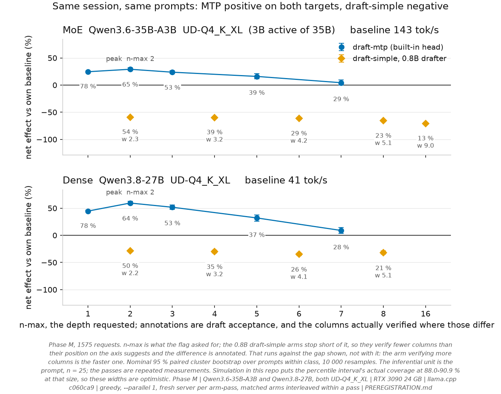
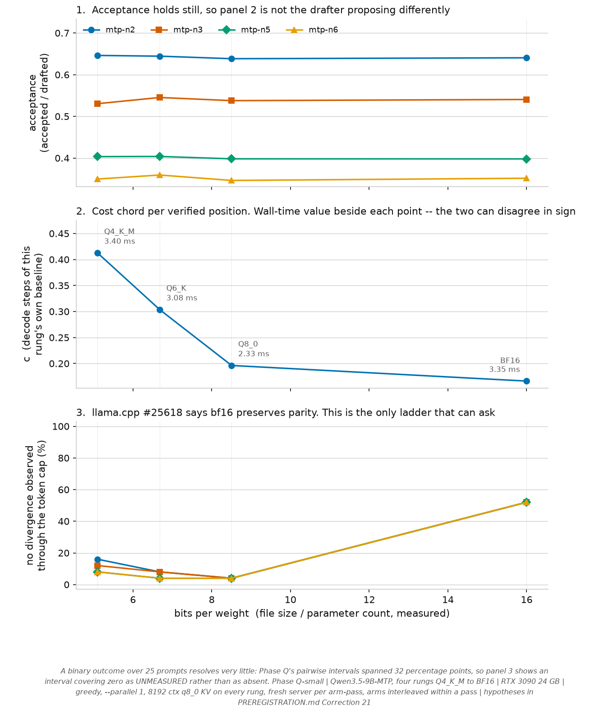

# Later phases

Phase A is the primary result and lives in [`README.md`](../README.md). This file holds the
follow-up phases in full, because keeping them there had the README doing eight jobs at once --
abstract, paper, evidence ledger, correction log, energy metrology essay, all-phase report,
reproduction manual and release notes -- and every internal contradiction found in the 2026-08-29
review came out of that. The generated status block in the README stays there and is computed from
the result files; this is the prose.

Each hypothesis was written down before its data existed, in the addenda to
[`PREREGISTRATION.md`](../PREREGISTRATION.md). Status is given per row and it is mixed: complete
and interpreted, complete with interpretation withheld, partially complete, and blocked. The status
column says which.

Absolute throughput from these phases is never pooled with Phase A's. They use additional hosts,
GPUs, models, engines and sessions; only within-host contrasts are compared. See
[`docs/GPU_AS_FOUND.md`](GPU_AS_FOUND.md).

| phase | question | status |
|---|---|---|
| **B** | under confidence gating, does the overhead scale with tokens drafted or tokens rejected? | **Replacement data collection complete**, 525 records, 0 exclusions, **0 incidents**. The original run took two host_contended incidents from processes of my own and was re-measured on 2026-08-28; the replacement reproduces the throughput effects arm for arm ([`analysis/rerun_agreement.txt`](../analysis/rerun_agreement.txt)). **Exploratory, and the causal reading is withheld.** Within this six-arm sweep a one-parameter cost-per-drafted-token model fits better than cost-per-rejected -- r2 **0.9802** against **0.8256**, residual-sum difference clearing zero by 21.14 half-widths -- and adding a per-step term keeps the ordering (step + drafted at 4.064 ms/step and 6.167 ms/drafted token, r2 **0.9923**, against 0.9678, clearing by 4.22). That is an in-sample fit comparison, not an identification. The two regressors correlate at **+0.9963** across arm means, so the joint fit is **not identified** and its solution puts a negative coefficient on rejection. The one near-matched pair, which is the only place the two counts move apart, clears zero by **1.19 half-widths** -- below this repository's own 1.3 threshold, so by its own rule that comparison is too close to lean on. The model-scoring implementation and the forward-count robustness sweep were both written after the data existed, and nothing intervenes on quantization or arithmetic intensity. Report: [`analysis/phase_b_mechanism.txt`](../analysis/phase_b_mechanism.txt) |
| **R** | which clock does each workload actually respond to? | **complete**, 1125 request records, 0 incidents, three methods crossed with five clock and power settings. The orderings reverse. Raising the memory clock moves the baseline with an elasticity of **0.783** [0.773, 0.793] and **0.718** [0.703, 0.732] over the two steps, against **0.100 to 0.167** for `mtp-n3` and `mtp-n7` -- the speculative arms barely respond. Over the upper SM-clock range it is the other way round: baseline **0.491** [0.485, 0.498] against **0.843** and **0.857**, about 1.7x. These are response measurements, not a roofline or a bottleneck attribution, and this phase varies the clocks through a **power cap**, so raising the memory clock takes power from the core and the two are not independently set. Phase R2 pins the SM clock instead and is the one that removes that confound. Report: [`analysis/phase_r_elasticity.txt`](../analysis/phase_r_elasticity.txt) |
| **R2** | does the compute elasticity hold with the SM clock pinned rather than power-capped? | **complete**, 1575 request records, 0 incidents |
| **KV** | does the width partition survive an f16 cache, or was it an artefact of q8_0? | **complete**, 175 records, 0 incidents. **It survives.** With an `f16` cache the fork positions group as they do at `q8_0`: of the 21 prompts on which at least two arms fork at the same character, 10 have every arm at one position and **11 split, every one of them exactly widths {3,4} against {5,6,8}** and none any other way. `mtp-n5` sits with the DFlash2 arms rather than with the other MTP ones, so the grouping is not drafter identity here either. The no-divergence-observed rate splits the same way, 16.0 % at widths 3 and 4 against 28.0 % at 5, 6 and 8. What this file cannot do is separate width from drafter family on its own -- no width in it carries two families, so width cannot be held while family varies, and it says so; `phase_nmax` is the matrix built for that. This row said only "complete" until 2026-09-02, so the control's answer was in `analysis/phase_kv_divergence.txt` and in no document. Report: [`analysis/phase_kv_divergence.txt`](../analysis/phase_kv_divergence.txt) |
| **n-max** | the full width ladder, 2 to 9, for the CUDA boundary question | **complete**, 1050 request records. Within the 400-token window, widths 2-8 produce two stable first-fork and censoring signatures, `{2,3,4}` and `{5,6,7,8}`, with 9 on its own past the MMVQ dispatch limit. The registered partition matched, but the four-build intervention then falsified warp count as its cause, so this is an observational signature and not a mechanism |
| **C** | does drafter quantization change the answer, and does the predecessor's v3.0 need an erratum? | **complete**, 750 request records, 0 incidents. It barely changes the answer. The point estimates against the same-tree baseline are ordered q8 **+53.4 %**, q4k **+52.0 %**, bf16 **+48.5 %**; no direct paired interval between two drafter precisions has been computed, so that ordering is descriptive and not a demonstrated separation. The class effect dwarfs the quantization effect: across the three precisions code runs +111 % to +118 %, reason +86 % to +92 % and zh -2.3 % to +0.8 %, a spread of more than a hundred points between classes against five between precisions. The three n-gram rows are activation diagnostics rather than three comparable efficacy measurements. `ngram-mod` emitted no drafts at all on 75 of 75 records, and that is the method working as designed, not a flag being ignored: its default `n_min = 48` discards the whole draft unless a match continues for 48 consecutive tokens, which a 400-token general writing, code and reasoning suite does not produce (Correction 25). Its -0.20 % measures entering the speculative path and drafting nothing, and its 75/75 match with the baseline is the absence of speculation rather than lossless speculation. `ngram-map-k` activated on 6 of 75 records, too sparsely for a workload-level efficacy reading. `ngram-cache` is the only frequently active n-gram arm here: it drafts 9699 tokens, accepts **none**, and that is where its -8.3 % comes from |
| **L** | does the long-context decode collapse of [#27623](https://github.com/ggml-org/llama.cpp/issues/27623) reproduce on sm_86, and does speculation survive it? | **complete**, five of five rungs, 180 records each, 0 incidents. **It does not reproduce in this configuration.** #27623 reports it on sm_89 with a Q3/IQ4 target under a different software stack; this is sm_86 at `UD-Q4_K_XL` with a `q8_0` cache on pinned revisions, so what follows is a failure to reproduce here and not a refutation there. Through a realised 98 300 tokens, past the 91 K worked example the report publishes, the baseline goes 39.7 -> 26.5 tok/s: a factor of **1.5 against the reported 25**, with the largest single-rung drop 1.16x and that on entering 64 K rather than past 80 K. The SM clock falls 1.60 % over the ladder, worth -0.43 points if the Phase R2 SM-clock elasticity of 0.266 transports to this depth regime, which is a sensitivity calculation rather than a measurement here -- short-context elasticity need not hold at 98 K -- and is far too small to account for most of the decline -- that rules out SM-clock drift as the explanation, not every thermal or power-level contribution. Speculation survives it, and `draft-dflash` has the highest retention POINT ESTIMATE at the two deepest tested rungs; no paired interval separates the methods, so that ordering is descriptive and a method separation is not established: retention against each method's own 8 K rung is 66.9 % for the baseline, 68.8 % for mtp-n2 and **74.6 % for dflash2-n4**, whose acceptance rises slightly over the ladder, 2.607 to 2.650, while MTP's is flat. Its speedup leads at the two deepest rungs, +59.8 % [+50.2, +69.4] against +53.4 % [+48.8, +58.1] at 96 K, on intervals that overlap, so that ordering is a consistent point estimate and not a separation |
| **M** | does `draft-mtp` at small n-max escape the penalty that a 0.8B `draft-simple` at n-max 8 suffers, and does the architecture decide it? | **Data collection complete, 1575 records, 0 incidents; causal and cost interpretation withheld.** In the per-protocol series MTP has positive point estimates on both targets and `draft-simple` negative ones on both, each peaking at n-max 2 (MoE +29.2 % [+26.6, +31.8], dense +59.5 % [+56.6, +62.5]), and acceptance tracks the drafter rather than the target (78 % for the built-in head on both, 21-23 % for the 0.8B on both). What the phase does **not** currently identify: the preregistered **anchor does not hold** -- the 0.8B arm it replicates came out -65.6 % [-67.6, -63.7] against a registered -32 % to -12 % -- and the phase's own gate then forbids reading anything in it as a statement about the predecessor or about architecture. 33 records are excluded from the per-protocol series for stopping before the cap; they are one prompt, `zh_self_intro`, across all three passes of all eleven MoE arms including `baseline-moe`, so the exclusion is balanced within the MoE half rather than treatment-correlated. It is still decided by an outcome, so the analyser now tabulates the intention-to-treat series beside the per-protocol one, and the two differ by **at most 0.42 points** across nineteen arms, with every dense arm identical: the exclusion rule does essentially no work, which is a measurement rather than an argument. And the `mean_len` derivation underneath every cost quantity **fails its own integrity check here** (mean gap -0.3494, worst 2.9054 over 1425 requests, against a documented bound under 1 %), so `k0`, `c`, the marginal-cost equality and the 3.1-fold fixed-cost ratio this row used to report are withdrawn. Corrections 9, 10, 13-19c. Figure: [`analysis/plot_phase_m.png`](../analysis/plot_phase_m.png) |
| **Q** | is the fitted whole-cycle cost chord associated with target-checkpoint quantization? | **Two rungs of four complete**, which is every rung this card can hold: UD-Q4_K_XL and UD-Q5_K_XL, 300 records and 0 incidents each, no arm-pass above sd 0.28 % against its own repeats. The fitted chord is 0.2842 at Q4 against 0.2554 at Q5; paired over the same 25 prompts on the shared widths {3,4,6} the difference is **+0.0288 [+0.0271, +0.0303]**, 10.1 % of Q4's, and 9.5x the widest within-rung pass spread. **In wall time the sign reverses**: the decode steps differ by 13.8 %, so the rung that pays 10 % less relative to itself pays 0.289 ms more per position. Acceptance moves at most +0.0079 and realised width at most 0.0027 across the rungs, every interval covering zero, so the drafter's proposal behaviour is stable within this design's resolution -- which is a statement about what it proposes and not about what its forward pass costs. **This is a cross-session association, not a causal estimate of target-verification cost.** The two rungs are separate sessions about eight hours apart, prompt pairing removes prompt difficulty but not hours-scale drift, and the MTP head is embedded in the target gguf and is quantized with it, so verifier and drafter-head compute move together. An interleaved rung design or a fixed external drafter is what would separate them. Byte-level divergence does not resolve: the share with no divergence observed through the cap falls from 24.0 % to 12.0 % at n-max 2 on intervals spanning 32 points -- unmeasured, not absent. Q6 and Q8_0 need 27.5 and 31.3 GB of VRAM and are **blocked on the card, not on disk**; an earlier version of this row said disk, because the driver was sizing a download from a VRAM table and demanding 33 GB for a 19.44 GiB file. Corrections 10, 11 |
| **Qs** | does the bf16 anchor #25618 rests on actually hold, and does #26750's CUDA acceptance figure reproduce on a second CUDA architecture? | **complete**, four rungs, 375 records each, 0 incidents. **The anchor holds as an effect and not as parity.** The share with **no divergence observed through output token 400** against each rung's own baseline is 16 / 8 / 4 % across Q4_K_M, Q6_K, Q8_0 and **52 % at BF16** -- every request stops at the cap and none reaches EOS, so a match inside the window is right-censored rather than identity to the end of an answer -- paired over the same prompts, the Q4_K_M-to-BF16 shift is **+36 to +44 pp** across the four tested MTP depths. Three of the four clear this repository's own 1.3-half-width sensitivity rule; the `mtp-n2` pair, **+36.0 pp [+16.0, +52.0]**, clears zero by only **0.89 half-widths**, which is inside the margin where the measured undercoverage can reach zero, so it is reported and not leaned on alone. But 52 % is not parity: 36 of 75 requests still diverge with **bf16 model weights** (the K/V cache is `q8_0` on every rung, so this is a weight-precision ladder and not an unquantized target), so #25618's "stays bit-identical on bf16" is too strong as written. Within the quantized rungs the rate *falls* with bit width, so bf16 is off that line rather than its endpoint. `mtp-n6@Q4_K_M` is the matched configuration for [#26750](https://github.com/ggml-org/llama.cpp/issues/26750) and measures **35.0 % [32.9, 37.3]** on sm_86, which is **57 points below** the ~92 % that report gives for Vulkan. Whether it agrees with that report's CUDA figure is **not established**: an overlap of intervals is a failure to exclude, not a reproduction, and what is unresolved is comparability rather than the figures: Correction 26 read both halves of that range from the issue and they are real and both CUDA -- 35.8 % on an RTX PRO 4000 (Blackwell) headline row and 40.7 % across four context and parallel sweep rows -- but that is a different CUDA architecture and a different prompt population, and the estimator behind it is **not known** to be the one computed here -- a class-stratified mean of per-request acceptance -- rather than a server-log aggregate over all drafted tokens, which is what `llama-server` itself reports. `c` falls with bit width (-0.019 per bit, clear of zero) but **saturates**, r2 0.666, and in wall time there is no trend at all (r2 0.019) because bf16's decode step is 2.44x Q4_K_M's. Acceptance is stable across the whole ladder, so the trend is not explained by the drafter's observed proposal behaviour. It is not evidence that the drafter's compute is unchanged: the MTP head lives inside the target gguf, so quantizing the target quantizes the head too, and its forward latency can move while its acceptance does not. Nothing here separates the two. Scored in Correction 22 against hypotheses registered in Correction 21 Figure: [`analysis/plot_qsmall_ladder.png`](../analysis/plot_qsmall_ladder.png) |
| **V** | does the same comparison hold on vLLM rather than llama.cpp? | **Run, and what this card can produce is one arm and six recorded failures.** 75 records, `baseline-vllm` only, three passes at 47.52 / 47.53 / 47.52 tok/s -- a 0.02 % spread, and the first decode-only rate this study has from vLLM, taken from `vllm:request_decode_time_seconds` over `vllm:generation_tokens_total` rather than from wall time. Prefill is 1.29 % of inference on these requests, which is what a wall-clock rate would have folded into the comparison. Both MTP arms failed to start on all three passes: the same 2.37 GiB allocation at `qwen3_5_mtp.py:244` every time, which is `vocab_size 248320 x hidden_size 5120 x 2 bytes` for a bf16 `lm_head` the checkpoint does not contain, on top of a 17.33 GiB target. Filed as [vllm#53887](https://github.com/vllm-project/vllm/issues/53887). Design and the memory arithmetic: [`docs/PHASE_V_DESIGN.md`](PHASE_V_DESIGN.md) |
| **E** | do the three readings of one window agree, and does their disagreement cancel in a ratio? | **complete**, 450 records, 0 incidents, the power limit stepped 420 / 250 / 150 W because at stock every arm sits between 409.8 and 415.7 W and the load never varies enough to separate a load-dependent instrument error from a constant one. **A control on the instruments; it is not a speedup or efficiency result and the 250 W and 150 W arms are not a configuration anyone would run.** The three caps produce **byte-identical output** -- 50 of 50 arm-prompt cells across all three, and 150 of 150 across the three passes -- so this compares one computation at three rates rather than three computations. The driver's cumulative counter and the integral of `power.draw.instant` agree to within **0.15 % on every arm mean**, systematically rather than symmetrically: all six means negative, -0.008 to -0.149 %, against a record-level spread of -1.229 to +0.958 %. The counter's apparent disagreement with `energy_j` runs -0.14 % to **+1.87 %** and regresses on the instantaneous field's own departure, over every file in `analysis/energy_instruments.txt` rather than this one, at **r = +0.839**, so it is that field's offset seen twice. **These are three readout paths over one sensor, not three instruments**, so the agreement bounds the processing and leaves the proportional bidirectional sensor error exactly where it was. The offset is **not proportional** -- over 119 file-arm cells and 7125 measured windows in twenty-eight result files it tracks total energy at r = +0.078 -- so it cannot be corrected by scaling and does not cancel between arms drawing different power; what it IS remains unmodelled. Phase E reproduces Phase A's decode-energy saving before any correction, **37.06 % against 37.10 %**, and correcting it in joules rather than per cent gives **36.3 %**. Reports: [`analysis/energy_instruments.txt`](../analysis/energy_instruments.txt), [`analysis/nvml_polling.txt`](../analysis/nvml_polling.txt). Correction 44 |
| **E2** | is the averaged field's offset the variation the smoothing removed? | **complete**, 450 records, 0 incidents, the same matrix and caps as Phase E so the two are directly comparable, re-run once `power_sd_w` and `power_sd_instant_w` were recorded. **A control on the instruments; it identifies no mechanism and refutes a fourth candidate.** `power.draw` is a one-second rolling average and `power.draw.instant` is not, so `sd_instant - sd` is directly how much of the trace's movement the averaging discarded. It correlates with the offset at **-0.342** pooled and **-0.250** within arms — the wrong sign — and the run's largest offset, `mtp-n2@pw420` at 41.12 J, sits on the *smallest* discarded spread of any arm. The quantitative test finishes it: a spread in watts over a window in seconds is joules, so `offset_J / (sd_lost × span)` would be about 1 and flat; it spans **0.012 to 6.807, a factor of 574**. This phase also added the correlation Phase E's analysis lacked — **the same correlations within each arm** — and it convicts the earlier best number: mean power is +0.863 pooled and **-0.239 within arms**, a between-arm relationship that had been read as a statement about the mechanism. `power_sd_w` is +0.960 pooled and +0.323 within. Four candidates are now refused and none identified. Report: [`analysis/offset_mechanism.txt`](../analysis/offset_mechanism.txt). Correction 46 |
| **E3** | does the offset depend on how often the power is sampled? | **complete**, 450 records and 0 incidents. Nine invocations holding 50 records each: three requested sampler periods -- 0.05, 0.10, 0.20 s -- over three rounds with the interval order rotated each round, so no interval sits in one part of the session. Report: [`analysis/sampling_rate.txt`](../analysis/sampling_rate.txt). Correction 47 |
| **E4** | does the averaged field lose its energy at the window's edges, and is the cost the width of its own average? | **complete**, 450 records and 0 incidents. **That both arms carry the same residual distinguishes nothing**, and the correction to Correction 48 is that it was read as though it did: at this roll both windows hold the same excursion, idle to the same cap and back, and the head terms above are within 3 % of each other and the middle terms within 0.5 %. Report: [`analysis/edge_model.txt`](../analysis/edge_model.txt). Correction 48 |
| **E5** | does the residual that survives Phase E4's roll scale with the step the window straddles? | **complete**, 225 records and 0 incidents. **But the split into those two numbers is not established by this design, and Correction 50 withdraws it as a quantity.** The cap is the only lever, and it moves the step and the span together: 287 W over 13.9 s at one end, 26.5 W over 49.4 s at the other, a Spearman of **-0.917** between them across the nine cells. Reports: [`analysis/step_scaling.txt`](../analysis/step_scaling.txt). Correction 49 |
| **E6** | does the residual follow the step or the span? Phase E5's cap moved both at once | **complete**, 225 records and 0 incidents. **Neither model is refused, and Correction 53 withdraws the claim that one was.** The span model predicted the residual would FALL by 6.84 J from the short cell to the long; it rose by **3.54 J**, and fitting 1/span here with the step held gives **-55.03** against E5's +101.14. **So Correction 50's withdrawal stands: the split into +19.7 ms and +3.56 J remains model-dependent.** **Temperature is the confound this phase introduces**, since a longer generation is a hotter card -- 74.2, 80.0 and 82.4 C, with the SM clock falling 57 MHz. Report: [`analysis/span_at_fixed_step.txt`](../analysis/span_at_fixed_step.txt). Correction 52 |

<picture>
  <source media="(prefers-color-scheme: dark)" srcset="../analysis/plot_phase_m_dark.png">
  
</picture>

<picture>
  <source media="(prefers-color-scheme: dark)" srcset="../analysis/plot_qsmall_ladder_dark.png">
  
</picture>

Phase M and Phase Q-small in full. Both are also linked from the table above.

## Phase M: why no cost quantity is drawn from it

- **Phase M's cost telemetry, and its exclusions.** The `mean_len` figure every cost quantity in
  Phase M rests on fails `cost_model.py`'s own integrity check on that phase, so no `k`, `c`, `k0`
  or fixed-cost decomposition is drawn from it.

  Its per-protocol series also drops 33 records that stopped before the cap -- one prompt across
  every MoE arm, baseline included, so balanced rather than treatment-correlated, but still an
  exclusion decided by an outcome -- and the analyser now tabulates the intention-to-treat series
  beside the per-protocol one, and the two differ by at most 0.42 points across nineteen arms with
  every dense arm identical. The inclusion indicator is balanced across all eleven MoE arms; that
  is not a claim that missingness is independent of treatment, since early stopping is an outcome
  observed after treatment.

  What would settle the cost quantities is llama.cpp exposing `n_draft_verif_steps`, which
  `server_slot_stats` already holds and `to_json()` does not publish.

## Phases Q and Q-small: the ladders are cross-session

- **The quantization ladders are cross-session.** Phase Q's two rungs and Phase Q-small's four
  each ran in their own session. Pairing over prompts removes prompt difficulty; it does not
  remove hours-scale drift in entry temperature, clocks or host load, and the within-rung pass
  spread bounds only the minutes-scale part of that. The MTP head is also embedded in the target
  gguf and is quantized with it, so a rung changes verifier and drafter-head compute together.
  Stable acceptance shows the drafter's proposals did not change; it does not show its forward
  pass cost the same.

## The energy-instrument phases, in detail

The table above carries each phase's counts, its verdict and its report. What a phase
measured, what it refuses and what it cannot say does not fit in a table cell -- the four
rows below had grown to between 2,224 and 3,643 characters each, which is a paragraph
pretending to be a column. The wording is unchanged; it has been moved.

### Phase E3 -- does the offset depend on how often the power is sampled?

**A control on the instruments; it is not a speedup or efficiency result**, and under `--passes 1`
the arm order does not rotate, so arm and position within an invocation are collinear and this
phase cannot be read for a difference between the arms.

**The requested interval is not the achieved rate**: the sampler queries and then waits, so 0.05 s
gives **14.30 Hz** rather than 20, and the three land at 14.30 / 8.43 / 4.71 Hz.

Both predictions were written down before the run -- PHYSICAL that both integrals converge as the
grid refines, ARTEFACT that the instantaneous integral grows with the rate while `energy_j` stays
put. **ARTEFACT is refused by its own rule.** The instantaneous integral does not move (**0.999x**
and **1.000x** from the slowest sampling to the fastest) and sits within **0.23 % of the driver's
cumulative counter at every rate** -- a counter read exactly twice per window, which is the one
reading this experiment cannot move. The averaged field sits **0.31 to 1.86 % below** that counter
and moves *away* from it as the grid refines, by +0.209 and +0.453 points.

So `power.draw` is the under-resolved reading and the offset is a real energy difference rather
than an integration artefact. The loss is **arm-dependent** -- 0.31 to 0.66 % on `baseline@pw420`
against 1.41 to 1.86 % on `mtp-n2@pw420` -- which is why it does not cancel in a ratio between two
arms.

The rounds exist to measure the noise floor and do: one integral reproduces to **0.153 %** across
rounds while the offset, a small difference of two large numbers, reproduces only to **9.4 %**.
The rotation did its job -- round means of `offset/sd` are 1.716 / 1.649 / 1.690 against an
interval effect of 0.955x and 1.149x. **No mechanism is identified here either**; what is settled
is which of the two readings is wrong.

### Phase E4 -- does the averaged field lose its energy at the window's edges?

Under `--passes 1` the arm order does not rotate, so this phase cannot be read for any difference
between the arms. **The offset collapses.** `baseline@pw420` goes 24.11 -> 12.49 -> **6.43 J**
across the three rolls and `mtp-n2@pw420` 46.03 -> 5.59 -> **6.35 J**, which is **0.267x** and
**0.138x**, against a round-to-round noise floor on the offset of 10.5 to 30 %. The window
LENGTHENS while that happens -- 9.89 to 13.89 s and 6.46 to 10.40 s -- so a per-second loss is
refused in the same line that a loss unchanged by flat idle is.

**`power.draw` is measured, not quoted: a boxcar with a median width of 1.00 to 1.10 s.** It is a
filtered `power.draw.instant`, so the width that reproduces one from the other is a direct read of
the filter, needing no assumption about the window's ends. The same value comes back on both arms
at every roll, with an rms residual of 1.2 to 1.6 W on the unrolled windows. The repository had
only ever quoted 'about a second' from a paper.

**The model then has no free parameter and accounts for the whole unrolled offset**: a boxcar of
width T loses `(T/2) x (the mean of the last T seconds minus the averaged field's own first
sample)`, that last term being by definition the mean over the T seconds BEFORE the window, which
is not sampled and does not need to be. Predicted against observed gives **1.06** on the baseline
and **1.08** on `mtp-n2`. It also disposes of the arm-dependence: T is one number, and `mtp-n2`
carries the larger offset only because its window's two ends differ by more.

**And the offset accrues where the model says**: of 23.82 J on the baseline, 23.38 lands in the
first T seconds, 0.06 in the middle and -0.10 in the last T; of 46.88 J on `mtp-n2`, 43.58 in the
first T.

**What survives is 5.7 J on both arms** at the longest roll, against energies of 4690 and 3200 J.
It is **not** a per-second loss: the plateau -- where the instantaneous field sits above 80 % of
its own maximum, trimmed a second at each end so the filter's ramps fall outside -- carries **0.6
to 0.9 J** of it, on an arm whose plateau runs 7.7 s and on one whose runs 4.1 s. The rest is at
the edges, which is where the boxcar model already is, so what survives is that model being
slightly the wrong SHAPE rather than a second mechanism beside it. Anything sized by that
excursion is PREDICTED to be equal on the two arms. Phase E5 varies it on purpose.

Nine invocations holding 50 records each: three settings of idle held around the sampling
window -- 0, 1.5 and 4.0 s -- over three rounds with the order rotated. **A control on the
instruments; not a speedup, efficiency or tok/J result**, and a rolled window's `energy_j`,
`decode_energy_j` and `sample_span_s` all include the roll, so `energy_instruments.py` refuses
to sweep any file declaring one. Thirteen of the 75 unrolled baseline records fit at the grid's
ceiling rather than near the median -- a flat trace carries no information about the width of a
filter over it, and forcing those to 1.00 s costs 0.50 W of rms where the other 62 pay 0.11 --
and every cell with a roll is 0 of 75.

### Phase E5 -- does the residual that survives Phase E4's roll scale with the step the window straddles?

**A control on the instruments**: every arm is the baseline and they differ only in the cap, so
nothing here is a speedup, an efficiency figure or a statement about speculative decoding, and a
rolled window's `energy_j` includes the roll.

Three models fit the same points about equally -- on the step, intercept **+3.56 J** at r =
+0.846; on 1/span, intercept **+1.38 J** at r = **+0.878**, which is the better fit; on the span,
intercept **+10.00 J** at r = -0.847. The intercept is a property of the model chosen and not of
the data. That the step-scaled reading agrees with Phase E4 -- 5.7 J over a 284 W step is 20.1 ms
against 19.7 here -- is consistency inside one model family and not independent confirmation,
since E4's figure is attributed to the step by the same assumption.

**It is still not a per-second loss.** The caps move the span 4.5x as well, 13.9 to 49.4 s, and
the plateau term stays at 0.2, 1.6 and -0.4 J while the plateau itself runs 7.8, 11.3 and 43.3 s.
A width that tracked the workload would mean the deconvolution was reading the load rather than
the filter.

**The non-linearity is named, and it is on one edge.** No linear time-invariant filter can produce
any of this: such a filter loses exactly `m x (end level - start level)` over a window whatever
happens inside, and at this roll both ends are idle. Fitting the width separately on each edge
gives the same 1.00 to 1.10 s, but the rms of that fit is under 2 W on the rise and up to **18 W
on the fall**. Stacked on the instantaneous field's own step down, the reported average decays,
**stalls for about 0.8 s at 30, 12.5 and 2.5 W above a boxcar** at the three caps, then drops to
meet it -- so it describes how power climbs and not how it falls. The stall scales with the step
and therefore feeds the slope.

**What is left is a fixed term of 1.4 to 3.6 J**, the range the candidate models put it at, which
none of them explains: an energy per window that scales with neither the step, the span, the
plateau nor the total.

One baseline arm at three power caps -- 420, 250 and 150 W -- with Phase E4's 4.0 s roll and its
traces, three passes so the rotation closes and each cap visits each order position exactly once
(verified in the file: positions [0,2,1], [1,0,2], [2,1,0]).

**The cap sets the step**, measured per record rather than assumed: **287.4, 122.1 and 26.5 W**
above an idle-with-model draw of 125 to 131 W, a range of 10.8x against the 1.4x the committed
records span on their own.

**Both a slope and an intercept come out non-zero in this fit, and the split between them is not
established.** Correction 50 withdrew it as a quantity and Correction 53 records that the
withdrawal stands: the cap moves the step and the span together at a Spearman of -0.917, a 1/span
fit describes the same nine cells marginally better with an intercept of +1.38 J, and Phase E6
leans against that model at t = 2.50 on two degrees of freedom without refusing it. What follows
is the fit, not a verdict.

Regressing the residual on the
step over the nine (arm, pass) cell means -- not the 225 records, which are three steps wearing a
crowd -- gives a slope of **+19.7 ms** and an intercept of **+3.56 J**, and fitting each pass
separately puts that intercept at 3.30, 3.16 and 4.21 J.

**And the averaging width does not move with the cap**, which is what every number above rests on:
median T is **1.050 s at all three**, quartiles 1.000 / 1.100, with 0 of 75 records at the search
grid's edge in each.

### Phase E6 -- does the residual follow the step or the span? Phase E5's cap moved both at once

**A control on the instruments**: one arm, no contrast, nothing about speculative decoding, and
the lengths are not this study's 400 so no throughput or energy figure here compares with another
phase.

**The manipulation worked**: the step moves **1.7 %** across the three (289.3, 286.3, 284.5 W)
while the span moves **2.57x** (9.04, 13.89, 23.23 s), against Phase E5's Spearman of -0.917
between them. The 400-token cell reproduces E5's top cap to two decimals -- span 13.89 against
13.91, step 286.3 against 287.4 -- so the two phases measure the same object and E5's two models
coincide there and diverge either side, which makes this a two-sided test.

But the error on that contrast is the scatter of the contrast itself, not of the round means:
paired within each round the difference is **+10.22, -4.06, +4.46 J**, so **+3.54 with an sd of
7.19 and a standard error of 4.15 on two degrees of freedom**. That puts the span model at **t =
2.50** -- a lean, not a refusal -- and the step model at **t = 0.85**. The per-round 1/span slopes
are -163.7, +69.7 and -72.0, mean **-55.3 with a standard error of 67.9**, which is not
distinguishable from zero either. At this scatter, refusing a 6.84 J effect at t = 3 would take
about **ten rounds**; this phase ran three. That number is a point estimate on two degrees of
freedom, and its own 95 % interval runs from **3 to 395 rounds**, so it prices nothing.

More rounds at this placement is also the wrong axis. The regressor that separates the two models
is `1/span`, so the spread the design buys is bounded by `1/span_short` however long the long
window is set: at the 9.04 s short cell the expected t against the span model tops out at **2.70**
with an unbounded long window, against 1.65 as run. The leverage is at the short end -- an
expected 3.01 at a 6 s short cell, on less generated text than this phase used -- and that is
where the measurement is already weakest. Correction 54.

Within a cell the residual correlates with it at **+0.034, +0.137 and -0.073**, and with position
in the pass at +0.041, +0.138 and +0.176; the two are collinear (r 0.35 to 0.79) so neither alone
would settle anything, but both being near zero rules out a strong effect of either.

**The residual is not monotone** -- 7.31, 11.48, 10.85 J -- which neither model predicts.

The 200-token cell has a plateau of only 2.93 s, about three averaging windows, and its fitted
width comes out a grid step lower than the other two at 1.000 s against 1.050. Dropping it leaves
the residual flat across a 1.67x span change, which is the step model's prediction, but that is a
post-hoc exclusion and is not the result.

Nine invocations holding 25 records each: one arm at the stock 420 W cap, so the step is held,
with the generation length moved instead -- 200, 400 and 800 tokens -- over three rounds with
the order rotated.
